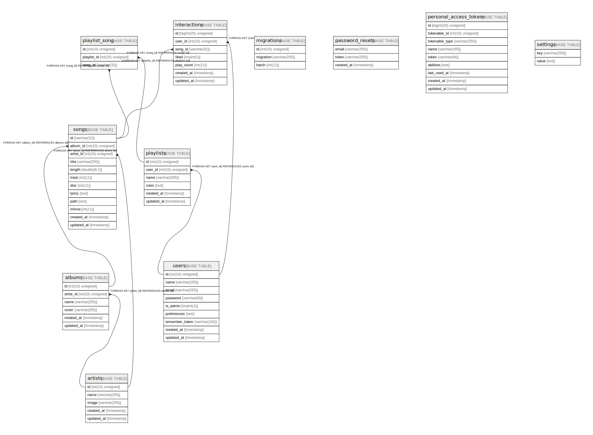

# koel

## Tables

| Name | Columns | Comment | Type |
| ---- | ------- | ------- | ---- |
| [albums](albums.md) | 6 |  | BASE TABLE |
| [artists](artists.md) | 5 |  | BASE TABLE |
| [interactions](interactions.md) | 7 |  | BASE TABLE |
| [migrations](migrations.md) | 3 |  | BASE TABLE |
| [password_resets](password_resets.md) | 3 |  | BASE TABLE |
| [personal_access_tokens](personal_access_tokens.md) | 9 |  | BASE TABLE |
| [playlist_song](playlist_song.md) | 3 |  | BASE TABLE |
| [playlists](playlists.md) | 6 |  | BASE TABLE |
| [settings](settings.md) | 2 |  | BASE TABLE |
| [songs](songs.md) | 12 |  | BASE TABLE |
| [users](users.md) | 9 |  | BASE TABLE |

## Relations

---

> Generated by [tbls](https://github.com/k1LoW/tbls)
