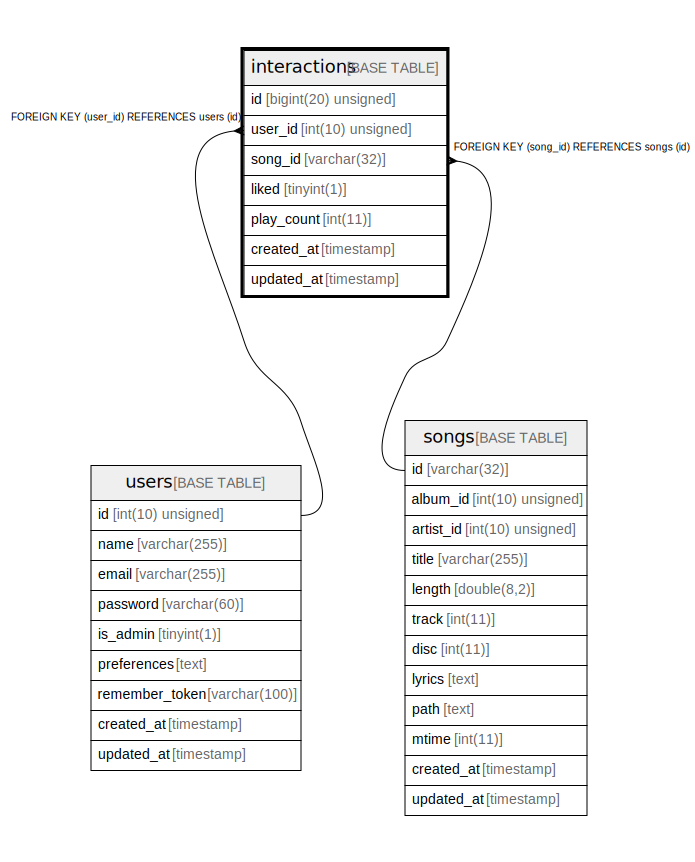

# interactions

## Description

<details>
<summary><strong>Table Definition</strong></summary>

```sql
CREATE TABLE `interactions` (
  `id` bigint(20) unsigned NOT NULL AUTO_INCREMENT,
  `user_id` int(10) unsigned NOT NULL,
  `song_id` varchar(32) COLLATE utf8mb4_unicode_ci NOT NULL,
  `liked` tinyint(1) NOT NULL DEFAULT '0',
  `play_count` int(11) NOT NULL DEFAULT '0',
  `created_at` timestamp NULL DEFAULT NULL,
  `updated_at` timestamp NULL DEFAULT NULL,
  PRIMARY KEY (`id`),
  KEY `interactions_user_id_foreign` (`user_id`),
  KEY `interactions_song_id_foreign` (`song_id`),
  CONSTRAINT `interactions_song_id_foreign` FOREIGN KEY (`song_id`) REFERENCES `songs` (`id`) ON DELETE CASCADE,
  CONSTRAINT `interactions_user_id_foreign` FOREIGN KEY (`user_id`) REFERENCES `users` (`id`) ON DELETE CASCADE
) ENGINE=InnoDB DEFAULT CHARSET=utf8mb4 COLLATE=utf8mb4_unicode_ci
```

</details>

## Columns

| Name | Type | Default | Nullable | Extra Definition | Children | Parents | Comment |
| ---- | ---- | ------- | -------- | --------------- | -------- | ------- | ------- |
| id | bigint(20) unsigned |  | false | auto_increment |  |  |  |
| user_id | int(10) unsigned |  | false |  |  | [users](users.md) |  |
| song_id | varchar(32) |  | false |  |  | [songs](songs.md) |  |
| liked | tinyint(1) | 0 | false |  |  |  |  |
| play_count | int(11) | 0 | false |  |  |  |  |
| created_at | timestamp |  | true |  |  |  |  |
| updated_at | timestamp |  | true |  |  |  |  |

## Constraints

| Name | Type | Definition |
| ---- | ---- | ---------- |
| interactions_song_id_foreign | FOREIGN KEY | FOREIGN KEY (song_id) REFERENCES songs (id) |
| interactions_user_id_foreign | FOREIGN KEY | FOREIGN KEY (user_id) REFERENCES users (id) |
| PRIMARY | PRIMARY KEY | PRIMARY KEY (id) |

## Indexes

| Name | Definition |
| ---- | ---------- |
| interactions_song_id_foreign | KEY interactions_song_id_foreign (song_id) USING BTREE |
| interactions_user_id_foreign | KEY interactions_user_id_foreign (user_id) USING BTREE |
| PRIMARY | PRIMARY KEY (id) USING BTREE |

## Relations



---

> Generated by [tbls](https://github.com/k1LoW/tbls)
