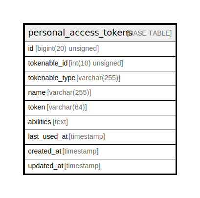

# personal_access_tokens

## Description

<details>
<summary><strong>Table Definition</strong></summary>

```sql
CREATE TABLE `personal_access_tokens` (
  `id` bigint(20) unsigned NOT NULL AUTO_INCREMENT,
  `tokenable_id` int(10) unsigned NOT NULL,
  `tokenable_type` varchar(255) COLLATE utf8mb4_unicode_ci NOT NULL,
  `name` varchar(255) COLLATE utf8mb4_unicode_ci NOT NULL,
  `token` varchar(64) COLLATE utf8mb4_unicode_ci NOT NULL,
  `abilities` text COLLATE utf8mb4_unicode_ci,
  `last_used_at` timestamp NULL DEFAULT NULL,
  `created_at` timestamp NULL DEFAULT NULL,
  `updated_at` timestamp NULL DEFAULT NULL,
  PRIMARY KEY (`id`),
  UNIQUE KEY `personal_access_tokens_token_unique` (`token`),
  KEY `personal_access_tokens_tokenable_id_tokenable_type_index` (`tokenable_id`,`tokenable_type`)
) ENGINE=InnoDB DEFAULT CHARSET=utf8mb4 COLLATE=utf8mb4_unicode_ci
```

</details>

## Columns

| Name | Type | Default | Nullable | Extra Definition | Children | Parents | Comment |
| ---- | ---- | ------- | -------- | --------------- | -------- | ------- | ------- |
| id | bigint(20) unsigned |  | false | auto_increment |  |  |  |
| tokenable_id | int(10) unsigned |  | false |  |  |  |  |
| tokenable_type | varchar(255) |  | false |  |  |  |  |
| name | varchar(255) |  | false |  |  |  |  |
| token | varchar(64) |  | false |  |  |  |  |
| abilities | text |  | true |  |  |  |  |
| last_used_at | timestamp |  | true |  |  |  |  |
| created_at | timestamp |  | true |  |  |  |  |
| updated_at | timestamp |  | true |  |  |  |  |

## Constraints

| Name | Type | Definition |
| ---- | ---- | ---------- |
| personal_access_tokens_token_unique | UNIQUE | UNIQUE KEY personal_access_tokens_token_unique (token) |
| PRIMARY | PRIMARY KEY | PRIMARY KEY (id) |

## Indexes

| Name | Definition |
| ---- | ---------- |
| personal_access_tokens_tokenable_id_tokenable_type_index | KEY personal_access_tokens_tokenable_id_tokenable_type_index (tokenable_id, tokenable_type) USING BTREE |
| PRIMARY | PRIMARY KEY (id) USING BTREE |
| personal_access_tokens_token_unique | UNIQUE KEY personal_access_tokens_token_unique (token) USING BTREE |

## Relations



---

> Generated by [tbls](https://github.com/k1LoW/tbls)
