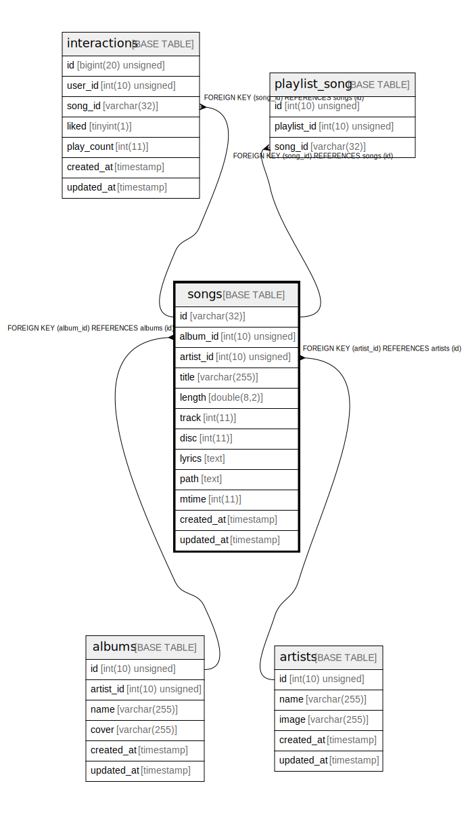

# songs

## Description

<details>
<summary><strong>Table Definition</strong></summary>

```sql
CREATE TABLE `songs` (
  `id` varchar(32) COLLATE utf8mb4_unicode_ci NOT NULL,
  `album_id` int(10) unsigned NOT NULL,
  `artist_id` int(10) unsigned DEFAULT NULL,
  `title` varchar(255) COLLATE utf8mb4_unicode_ci NOT NULL,
  `length` double(8,2) NOT NULL,
  `track` int(11) DEFAULT NULL,
  `disc` int(11) NOT NULL DEFAULT '1',
  `lyrics` text COLLATE utf8mb4_unicode_ci NOT NULL,
  `path` text COLLATE utf8mb4_unicode_ci NOT NULL,
  `mtime` int(11) NOT NULL,
  `created_at` timestamp NULL DEFAULT NULL,
  `updated_at` timestamp NULL DEFAULT NULL,
  PRIMARY KEY (`id`),
  KEY `songs_album_id_foreign` (`album_id`),
  KEY `songs_artist_id_foreign` (`artist_id`),
  CONSTRAINT `songs_album_id_foreign` FOREIGN KEY (`album_id`) REFERENCES `albums` (`id`),
  CONSTRAINT `songs_artist_id_foreign` FOREIGN KEY (`artist_id`) REFERENCES `artists` (`id`) ON DELETE CASCADE
) ENGINE=InnoDB DEFAULT CHARSET=utf8mb4 COLLATE=utf8mb4_unicode_ci
```

</details>

## Columns

| Name | Type | Default | Nullable | Children | Parents | Comment |
| ---- | ---- | ------- | -------- | -------- | ------- | ------- |
| id | varchar(32) |  | false | [interactions](interactions.md) [playlist_song](playlist_song.md) |  |  |
| album_id | int(10) unsigned |  | false |  | [albums](albums.md) |  |
| artist_id | int(10) unsigned |  | true |  | [artists](artists.md) |  |
| title | varchar(255) |  | false |  |  |  |
| length | double(8,2) |  | false |  |  |  |
| track | int(11) |  | true |  |  |  |
| disc | int(11) | 1 | false |  |  |  |
| lyrics | text |  | false |  |  |  |
| path | text |  | false |  |  |  |
| mtime | int(11) |  | false |  |  |  |
| created_at | timestamp |  | true |  |  |  |
| updated_at | timestamp |  | true |  |  |  |

## Constraints

| Name | Type | Definition |
| ---- | ---- | ---------- |
| PRIMARY | PRIMARY KEY | PRIMARY KEY (id) |
| songs_album_id_foreign | FOREIGN KEY | FOREIGN KEY (album_id) REFERENCES albums (id) |
| songs_artist_id_foreign | FOREIGN KEY | FOREIGN KEY (artist_id) REFERENCES artists (id) |

## Indexes

| Name | Definition |
| ---- | ---------- |
| songs_album_id_foreign | KEY songs_album_id_foreign (album_id) USING BTREE |
| songs_artist_id_foreign | KEY songs_artist_id_foreign (artist_id) USING BTREE |
| PRIMARY | PRIMARY KEY (id) USING BTREE |

## Relations



---

> Generated by [tbls](https://github.com/k1LoW/tbls)
