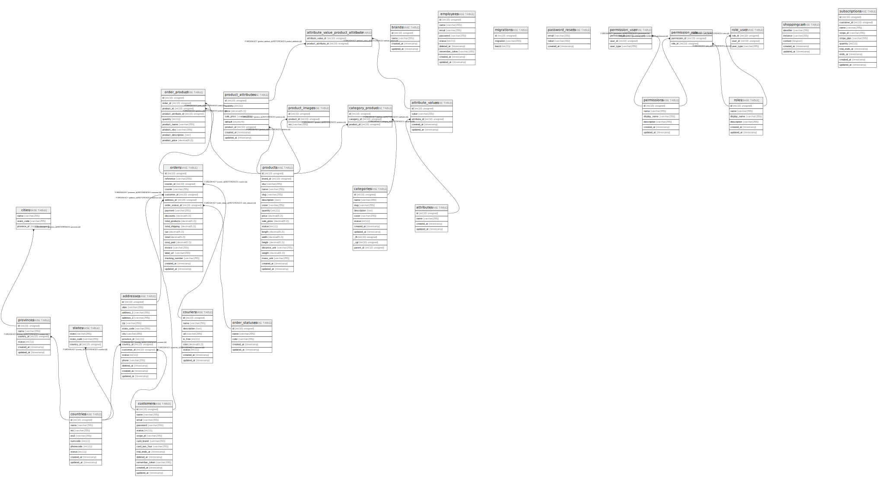

# laracom

## Tables

| Name | Columns | Comment | Type |
| ---- | ------- | ------- | ---- |
| [addresses](addresses.md) | 15 |  | BASE TABLE |
| [attribute_value_product_attribute](attribute_value_product_attribute.md) | 2 |  | BASE TABLE |
| [attribute_values](attribute_values.md) | 5 |  | BASE TABLE |
| [attributes](attributes.md) | 4 |  | BASE TABLE |
| [brands](brands.md) | 4 |  | BASE TABLE |
| [categories](categories.md) | 11 |  | BASE TABLE |
| [category_product](category_product.md) | 3 |  | BASE TABLE |
| [cities](cities.md) | 3 |  | BASE TABLE |
| [countries](countries.md) | 9 |  | BASE TABLE |
| [couriers](couriers.md) | 9 |  | BASE TABLE |
| [customers](customers.md) | 13 |  | BASE TABLE |
| [employees](employees.md) | 9 |  | BASE TABLE |
| [migrations](migrations.md) | 3 |  | BASE TABLE |
| [order_product](order_product.md) | 9 |  | BASE TABLE |
| [order_statuses](order_statuses.md) | 5 |  | BASE TABLE |
| [orders](orders.md) | 19 |  | BASE TABLE |
| [password_resets](password_resets.md) | 3 |  | BASE TABLE |
| [permission_role](permission_role.md) | 2 |  | BASE TABLE |
| [permission_user](permission_user.md) | 3 |  | BASE TABLE |
| [permissions](permissions.md) | 6 |  | BASE TABLE |
| [product_attributes](product_attributes.md) | 8 |  | BASE TABLE |
| [product_images](product_images.md) | 3 |  | BASE TABLE |
| [products](products.md) | 19 |  | BASE TABLE |
| [provinces](provinces.md) | 6 |  | BASE TABLE |
| [role_user](role_user.md) | 3 |  | BASE TABLE |
| [roles](roles.md) | 6 |  | BASE TABLE |
| [shoppingcart](shoppingcart.md) | 5 |  | BASE TABLE |
| [states](states.md) | 3 |  | BASE TABLE |
| [subscriptions](subscriptions.md) | 10 |  | BASE TABLE |

## Relations

---

> Generated by [tbls](https://github.com/k1LoW/tbls)
