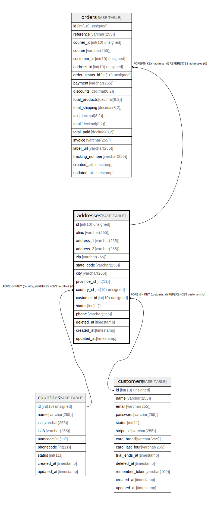

# addresses

## Description

<details>
<summary><strong>Table Definition</strong></summary>

```sql
CREATE TABLE `addresses` (
  `id` int(10) unsigned NOT NULL AUTO_INCREMENT,
  `alias` varchar(255) COLLATE utf8mb4_unicode_ci NOT NULL,
  `address_1` varchar(255) COLLATE utf8mb4_unicode_ci NOT NULL,
  `address_2` varchar(255) COLLATE utf8mb4_unicode_ci DEFAULT NULL,
  `zip` varchar(255) COLLATE utf8mb4_unicode_ci DEFAULT NULL,
  `state_code` varchar(255) COLLATE utf8mb4_unicode_ci DEFAULT NULL,
  `city` varchar(255) COLLATE utf8mb4_unicode_ci DEFAULT NULL,
  `province_id` int(11) DEFAULT NULL,
  `country_id` int(10) unsigned NOT NULL,
  `customer_id` int(10) unsigned NOT NULL,
  `status` int(11) NOT NULL DEFAULT '0',
  `phone` varchar(255) COLLATE utf8mb4_unicode_ci DEFAULT NULL,
  `deleted_at` timestamp NULL DEFAULT NULL,
  `created_at` timestamp NULL DEFAULT NULL,
  `updated_at` timestamp NULL DEFAULT NULL,
  PRIMARY KEY (`id`),
  KEY `addresses_country_id_index` (`country_id`),
  KEY `addresses_customer_id_index` (`customer_id`),
  CONSTRAINT `addresses_country_id_foreign` FOREIGN KEY (`country_id`) REFERENCES `countries` (`id`),
  CONSTRAINT `addresses_customer_id_foreign` FOREIGN KEY (`customer_id`) REFERENCES `customers` (`id`)
) ENGINE=InnoDB AUTO_INCREMENT=[Redacted by tbls] DEFAULT CHARSET=utf8mb4 COLLATE=utf8mb4_unicode_ci
```

</details>

## Columns

| Name | Type | Default | Nullable | Extra Definition | Children | Parents | Comment |
| ---- | ---- | ------- | -------- | --------------- | -------- | ------- | ------- |
| id | int(10) unsigned |  | false | auto_increment | [orders](orders.md) |  |  |
| alias | varchar(255) |  | false |  |  |  |  |
| address_1 | varchar(255) |  | false |  |  |  |  |
| address_2 | varchar(255) |  | true |  |  |  |  |
| zip | varchar(255) |  | true |  |  |  |  |
| state_code | varchar(255) |  | true |  |  |  |  |
| city | varchar(255) |  | true |  |  |  |  |
| province_id | int(11) |  | true |  |  |  |  |
| country_id | int(10) unsigned |  | false |  |  | [countries](countries.md) |  |
| customer_id | int(10) unsigned |  | false |  |  | [customers](customers.md) |  |
| status | int(11) | 0 | false |  |  |  |  |
| phone | varchar(255) |  | true |  |  |  |  |
| deleted_at | timestamp |  | true |  |  |  |  |
| created_at | timestamp |  | true |  |  |  |  |
| updated_at | timestamp |  | true |  |  |  |  |

## Constraints

| Name | Type | Definition |
| ---- | ---- | ---------- |
| addresses_country_id_foreign | FOREIGN KEY | FOREIGN KEY (country_id) REFERENCES countries (id) |
| addresses_customer_id_foreign | FOREIGN KEY | FOREIGN KEY (customer_id) REFERENCES customers (id) |
| PRIMARY | PRIMARY KEY | PRIMARY KEY (id) |

## Indexes

| Name | Definition |
| ---- | ---------- |
| addresses_country_id_index | KEY addresses_country_id_index (country_id) USING BTREE |
| addresses_customer_id_index | KEY addresses_customer_id_index (customer_id) USING BTREE |
| PRIMARY | PRIMARY KEY (id) USING BTREE |

## Relations



---

> Generated by [tbls](https://github.com/k1LoW/tbls)
