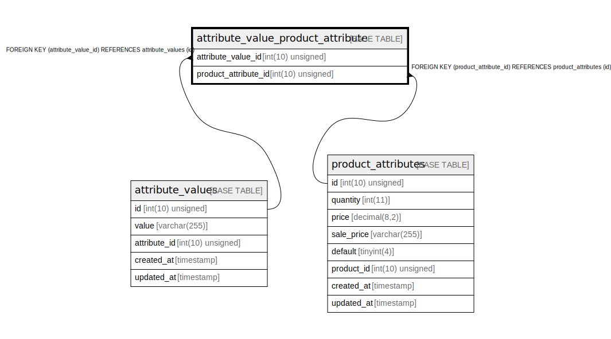

# attribute_value_product_attribute

## Description

<details>
<summary><strong>Table Definition</strong></summary>

```sql
CREATE TABLE `attribute_value_product_attribute` (
  `attribute_value_id` int(10) unsigned NOT NULL,
  `product_attribute_id` int(10) unsigned NOT NULL,
  KEY `attribute_value_product_attribute_attribute_value_id_foreign` (`attribute_value_id`),
  KEY `attribute_value_product_attribute_product_attribute_id_foreign` (`product_attribute_id`),
  CONSTRAINT `attribute_value_product_attribute_attribute_value_id_foreign` FOREIGN KEY (`attribute_value_id`) REFERENCES `attribute_values` (`id`),
  CONSTRAINT `attribute_value_product_attribute_product_attribute_id_foreign` FOREIGN KEY (`product_attribute_id`) REFERENCES `product_attributes` (`id`)
) ENGINE=InnoDB DEFAULT CHARSET=utf8mb4 COLLATE=utf8mb4_unicode_ci
```

</details>

## Columns

| Name | Type | Default | Nullable | Children | Parents | Comment |
| ---- | ---- | ------- | -------- | -------- | ------- | ------- |
| attribute_value_id | int(10) unsigned |  | false |  | [attribute_values](attribute_values.md) |  |
| product_attribute_id | int(10) unsigned |  | false |  | [product_attributes](product_attributes.md) |  |

## Constraints

| Name | Type | Definition |
| ---- | ---- | ---------- |
| attribute_value_product_attribute_attribute_value_id_foreign | FOREIGN KEY | FOREIGN KEY (attribute_value_id) REFERENCES attribute_values (id) |
| attribute_value_product_attribute_product_attribute_id_foreign | FOREIGN KEY | FOREIGN KEY (product_attribute_id) REFERENCES product_attributes (id) |

## Indexes

| Name | Definition |
| ---- | ---------- |
| attribute_value_product_attribute_attribute_value_id_foreign | KEY attribute_value_product_attribute_attribute_value_id_foreign (attribute_value_id) USING BTREE |
| attribute_value_product_attribute_product_attribute_id_foreign | KEY attribute_value_product_attribute_product_attribute_id_foreign (product_attribute_id) USING BTREE |

## Relations



---

> Generated by [tbls](https://github.com/k1LoW/tbls)
