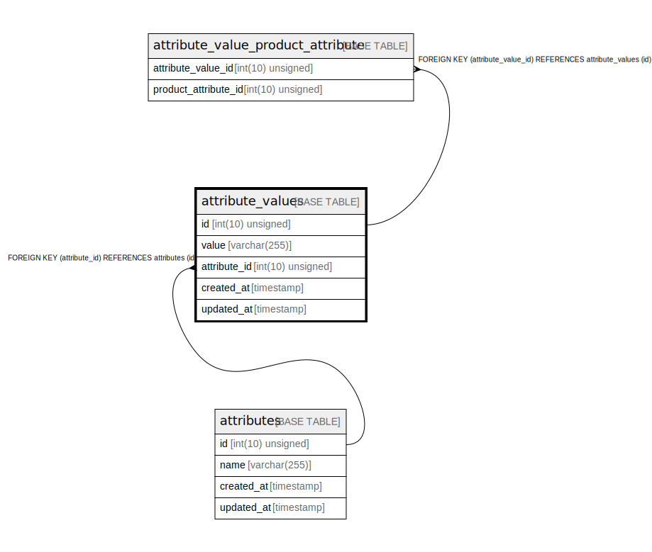

# attribute_values

## Description

<details>
<summary><strong>Table Definition</strong></summary>

```sql
CREATE TABLE `attribute_values` (
  `id` int(10) unsigned NOT NULL AUTO_INCREMENT,
  `value` varchar(255) COLLATE utf8mb4_unicode_ci NOT NULL,
  `attribute_id` int(10) unsigned NOT NULL,
  `created_at` timestamp NULL DEFAULT NULL,
  `updated_at` timestamp NULL DEFAULT NULL,
  PRIMARY KEY (`id`),
  KEY `attribute_values_attribute_id_foreign` (`attribute_id`),
  CONSTRAINT `attribute_values_attribute_id_foreign` FOREIGN KEY (`attribute_id`) REFERENCES `attributes` (`id`)
) ENGINE=InnoDB AUTO_INCREMENT=[Redacted by tbls] DEFAULT CHARSET=utf8mb4 COLLATE=utf8mb4_unicode_ci
```

</details>

## Columns

| Name | Type | Default | Nullable | Extra Definition | Children | Parents | Comment |
| ---- | ---- | ------- | -------- | --------------- | -------- | ------- | ------- |
| id | int(10) unsigned |  | false | auto_increment | [attribute_value_product_attribute](attribute_value_product_attribute.md) |  |  |
| value | varchar(255) |  | false |  |  |  |  |
| attribute_id | int(10) unsigned |  | false |  |  | [attributes](attributes.md) |  |
| created_at | timestamp |  | true |  |  |  |  |
| updated_at | timestamp |  | true |  |  |  |  |

## Constraints

| Name | Type | Definition |
| ---- | ---- | ---------- |
| attribute_values_attribute_id_foreign | FOREIGN KEY | FOREIGN KEY (attribute_id) REFERENCES attributes (id) |
| PRIMARY | PRIMARY KEY | PRIMARY KEY (id) |

## Indexes

| Name | Definition |
| ---- | ---------- |
| attribute_values_attribute_id_foreign | KEY attribute_values_attribute_id_foreign (attribute_id) USING BTREE |
| PRIMARY | PRIMARY KEY (id) USING BTREE |

## Relations



---

> Generated by [tbls](https://github.com/k1LoW/tbls)
