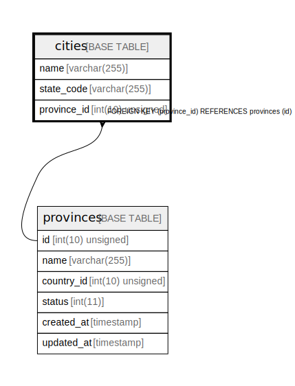

# cities

## Description

<details>
<summary><strong>Table Definition</strong></summary>

```sql
CREATE TABLE `cities` (
  `name` varchar(255) COLLATE utf8mb4_unicode_ci NOT NULL,
  `state_code` varchar(255) COLLATE utf8mb4_unicode_ci DEFAULT NULL,
  `province_id` int(10) unsigned DEFAULT NULL,
  KEY `cities_province_id_foreign` (`province_id`),
  CONSTRAINT `cities_province_id_foreign` FOREIGN KEY (`province_id`) REFERENCES `provinces` (`id`)
) ENGINE=InnoDB DEFAULT CHARSET=utf8mb4 COLLATE=utf8mb4_unicode_ci
```

</details>

## Columns

| Name | Type | Default | Nullable | Children | Parents | Comment |
| ---- | ---- | ------- | -------- | -------- | ------- | ------- |
| name | varchar(255) |  | false |  |  |  |
| state_code | varchar(255) |  | true |  |  |  |
| province_id | int(10) unsigned |  | true |  | [provinces](provinces.md) |  |

## Constraints

| Name | Type | Definition |
| ---- | ---- | ---------- |
| cities_province_id_foreign | FOREIGN KEY | FOREIGN KEY (province_id) REFERENCES provinces (id) |

## Indexes

| Name | Definition |
| ---- | ---------- |
| cities_province_id_foreign | KEY cities_province_id_foreign (province_id) USING BTREE |

## Relations



---

> Generated by [tbls](https://github.com/k1LoW/tbls)
