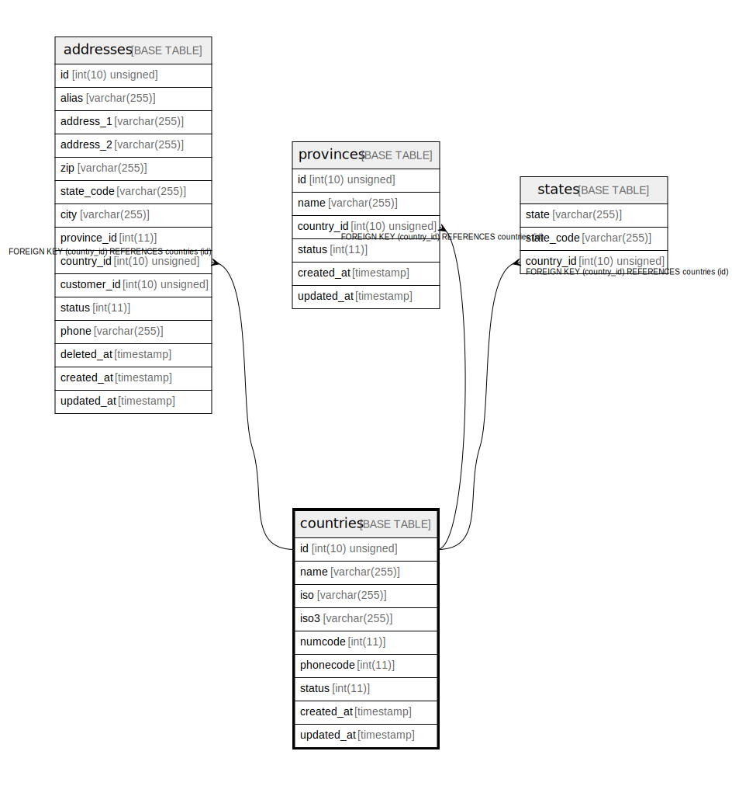

# countries

## Description

<details>
<summary><strong>Table Definition</strong></summary>

```sql
CREATE TABLE `countries` (
  `id` int(10) unsigned NOT NULL AUTO_INCREMENT,
  `name` varchar(255) COLLATE utf8mb4_unicode_ci NOT NULL,
  `iso` varchar(255) COLLATE utf8mb4_unicode_ci NOT NULL,
  `iso3` varchar(255) COLLATE utf8mb4_unicode_ci DEFAULT NULL,
  `numcode` int(11) DEFAULT NULL,
  `phonecode` int(11) NOT NULL,
  `status` int(11) NOT NULL,
  `created_at` timestamp NULL DEFAULT NULL,
  `updated_at` timestamp NULL DEFAULT NULL,
  PRIMARY KEY (`id`),
  UNIQUE KEY `countries_name_unique` (`name`),
  UNIQUE KEY `countries_iso_unique` (`iso`)
) ENGINE=InnoDB AUTO_INCREMENT=[Redacted by tbls] DEFAULT CHARSET=utf8mb4 COLLATE=utf8mb4_unicode_ci
```

</details>

## Columns

| Name | Type | Default | Nullable | Extra Definition | Children | Parents | Comment |
| ---- | ---- | ------- | -------- | --------------- | -------- | ------- | ------- |
| id | int(10) unsigned |  | false | auto_increment | [addresses](addresses.md) [provinces](provinces.md) [states](states.md) |  |  |
| name | varchar(255) |  | false |  |  |  |  |
| iso | varchar(255) |  | false |  |  |  |  |
| iso3 | varchar(255) |  | true |  |  |  |  |
| numcode | int(11) |  | true |  |  |  |  |
| phonecode | int(11) |  | false |  |  |  |  |
| status | int(11) |  | false |  |  |  |  |
| created_at | timestamp |  | true |  |  |  |  |
| updated_at | timestamp |  | true |  |  |  |  |

## Constraints

| Name | Type | Definition |
| ---- | ---- | ---------- |
| countries_iso_unique | UNIQUE | UNIQUE KEY countries_iso_unique (iso) |
| countries_name_unique | UNIQUE | UNIQUE KEY countries_name_unique (name) |
| PRIMARY | PRIMARY KEY | PRIMARY KEY (id) |

## Indexes

| Name | Definition |
| ---- | ---------- |
| PRIMARY | PRIMARY KEY (id) USING BTREE |
| countries_iso_unique | UNIQUE KEY countries_iso_unique (iso) USING BTREE |
| countries_name_unique | UNIQUE KEY countries_name_unique (name) USING BTREE |

## Relations



---

> Generated by [tbls](https://github.com/k1LoW/tbls)
