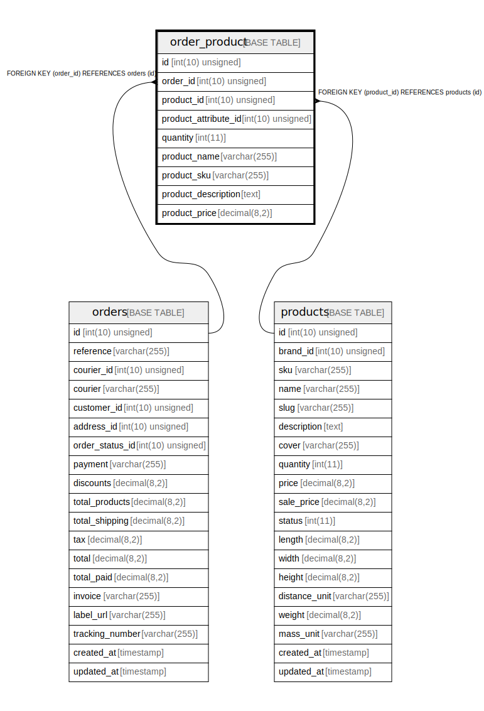

# order_product

## Description

<details>
<summary><strong>Table Definition</strong></summary>

```sql
CREATE TABLE `order_product` (
  `id` int(10) unsigned NOT NULL AUTO_INCREMENT,
  `order_id` int(10) unsigned NOT NULL,
  `product_id` int(10) unsigned NOT NULL,
  `product_attribute_id` int(10) unsigned DEFAULT NULL,
  `quantity` int(11) NOT NULL,
  `product_name` varchar(255) COLLATE utf8mb4_unicode_ci DEFAULT NULL,
  `product_sku` varchar(255) COLLATE utf8mb4_unicode_ci DEFAULT NULL,
  `product_description` text COLLATE utf8mb4_unicode_ci,
  `product_price` decimal(8,2) DEFAULT NULL,
  PRIMARY KEY (`id`),
  KEY `order_product_order_id_index` (`order_id`),
  KEY `order_product_product_id_index` (`product_id`),
  CONSTRAINT `order_product_order_id_foreign` FOREIGN KEY (`order_id`) REFERENCES `orders` (`id`),
  CONSTRAINT `order_product_product_id_foreign` FOREIGN KEY (`product_id`) REFERENCES `products` (`id`)
) ENGINE=InnoDB DEFAULT CHARSET=utf8mb4 COLLATE=utf8mb4_unicode_ci
```

</details>

## Columns

| Name | Type | Default | Nullable | Extra Definition | Children | Parents | Comment |
| ---- | ---- | ------- | -------- | --------------- | -------- | ------- | ------- |
| id | int(10) unsigned |  | false | auto_increment |  |  |  |
| order_id | int(10) unsigned |  | false |  |  | [orders](orders.md) |  |
| product_id | int(10) unsigned |  | false |  |  | [products](products.md) |  |
| product_attribute_id | int(10) unsigned |  | true |  |  |  |  |
| quantity | int(11) |  | false |  |  |  |  |
| product_name | varchar(255) |  | true |  |  |  |  |
| product_sku | varchar(255) |  | true |  |  |  |  |
| product_description | text |  | true |  |  |  |  |
| product_price | decimal(8,2) |  | true |  |  |  |  |

## Constraints

| Name | Type | Definition |
| ---- | ---- | ---------- |
| order_product_order_id_foreign | FOREIGN KEY | FOREIGN KEY (order_id) REFERENCES orders (id) |
| order_product_product_id_foreign | FOREIGN KEY | FOREIGN KEY (product_id) REFERENCES products (id) |
| PRIMARY | PRIMARY KEY | PRIMARY KEY (id) |

## Indexes

| Name | Definition |
| ---- | ---------- |
| order_product_order_id_index | KEY order_product_order_id_index (order_id) USING BTREE |
| order_product_product_id_index | KEY order_product_product_id_index (product_id) USING BTREE |
| PRIMARY | PRIMARY KEY (id) USING BTREE |

## Relations



---

> Generated by [tbls](https://github.com/k1LoW/tbls)
