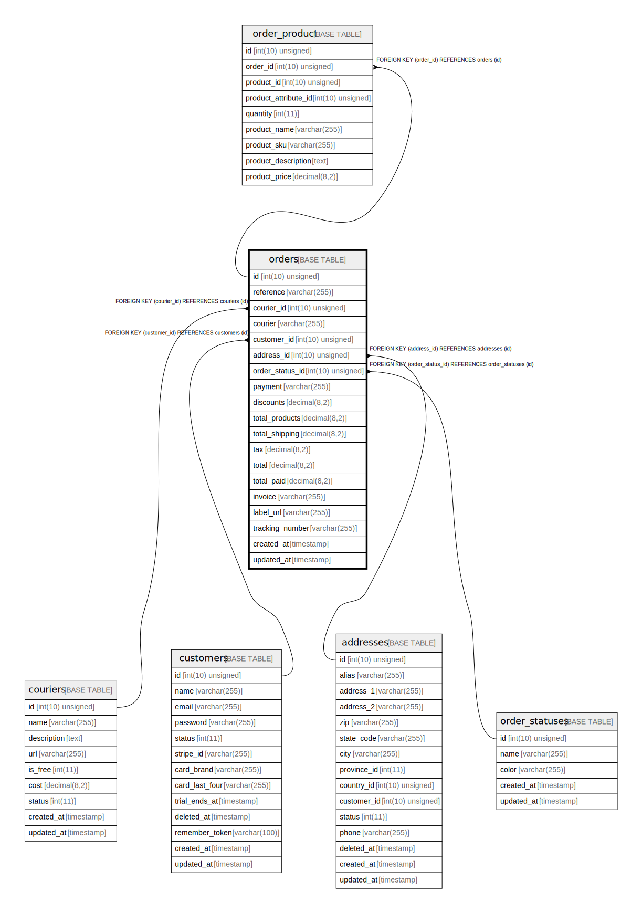

# orders

## Description

<details>
<summary><strong>Table Definition</strong></summary>

```sql
CREATE TABLE `orders` (
  `id` int(10) unsigned NOT NULL AUTO_INCREMENT,
  `reference` varchar(255) COLLATE utf8mb4_unicode_ci NOT NULL,
  `courier_id` int(10) unsigned NOT NULL,
  `courier` varchar(255) COLLATE utf8mb4_unicode_ci DEFAULT NULL,
  `customer_id` int(10) unsigned NOT NULL,
  `address_id` int(10) unsigned NOT NULL,
  `order_status_id` int(10) unsigned NOT NULL,
  `payment` varchar(255) COLLATE utf8mb4_unicode_ci NOT NULL,
  `discounts` decimal(8,2) NOT NULL DEFAULT '0.00',
  `total_products` decimal(8,2) NOT NULL,
  `total_shipping` decimal(8,2) NOT NULL DEFAULT '0.00',
  `tax` decimal(8,2) NOT NULL DEFAULT '0.00',
  `total` decimal(8,2) NOT NULL,
  `total_paid` decimal(8,2) NOT NULL DEFAULT '0.00',
  `invoice` varchar(255) COLLATE utf8mb4_unicode_ci DEFAULT NULL,
  `label_url` varchar(255) COLLATE utf8mb4_unicode_ci DEFAULT NULL,
  `tracking_number` varchar(255) COLLATE utf8mb4_unicode_ci DEFAULT NULL,
  `created_at` timestamp NULL DEFAULT NULL,
  `updated_at` timestamp NULL DEFAULT NULL,
  PRIMARY KEY (`id`),
  UNIQUE KEY `orders_reference_unique` (`reference`),
  KEY `orders_courier_id_index` (`courier_id`),
  KEY `orders_customer_id_index` (`customer_id`),
  KEY `orders_address_id_index` (`address_id`),
  KEY `orders_order_status_id_index` (`order_status_id`),
  CONSTRAINT `orders_address_id_foreign` FOREIGN KEY (`address_id`) REFERENCES `addresses` (`id`),
  CONSTRAINT `orders_courier_id_foreign` FOREIGN KEY (`courier_id`) REFERENCES `couriers` (`id`),
  CONSTRAINT `orders_customer_id_foreign` FOREIGN KEY (`customer_id`) REFERENCES `customers` (`id`),
  CONSTRAINT `orders_order_status_id_foreign` FOREIGN KEY (`order_status_id`) REFERENCES `order_statuses` (`id`)
) ENGINE=InnoDB DEFAULT CHARSET=utf8mb4 COLLATE=utf8mb4_unicode_ci
```

</details>

## Columns

| Name | Type | Default | Nullable | Extra Definition | Children | Parents | Comment |
| ---- | ---- | ------- | -------- | --------------- | -------- | ------- | ------- |
| id | int(10) unsigned |  | false | auto_increment | [order_product](order_product.md) |  |  |
| reference | varchar(255) |  | false |  |  |  |  |
| courier_id | int(10) unsigned |  | false |  |  | [couriers](couriers.md) |  |
| courier | varchar(255) |  | true |  |  |  |  |
| customer_id | int(10) unsigned |  | false |  |  | [customers](customers.md) |  |
| address_id | int(10) unsigned |  | false |  |  | [addresses](addresses.md) |  |
| order_status_id | int(10) unsigned |  | false |  |  | [order_statuses](order_statuses.md) |  |
| payment | varchar(255) |  | false |  |  |  |  |
| discounts | decimal(8,2) | 0.00 | false |  |  |  |  |
| total_products | decimal(8,2) |  | false |  |  |  |  |
| total_shipping | decimal(8,2) | 0.00 | false |  |  |  |  |
| tax | decimal(8,2) | 0.00 | false |  |  |  |  |
| total | decimal(8,2) |  | false |  |  |  |  |
| total_paid | decimal(8,2) | 0.00 | false |  |  |  |  |
| invoice | varchar(255) |  | true |  |  |  |  |
| label_url | varchar(255) |  | true |  |  |  |  |
| tracking_number | varchar(255) |  | true |  |  |  |  |
| created_at | timestamp |  | true |  |  |  |  |
| updated_at | timestamp |  | true |  |  |  |  |

## Constraints

| Name | Type | Definition |
| ---- | ---- | ---------- |
| orders_address_id_foreign | FOREIGN KEY | FOREIGN KEY (address_id) REFERENCES addresses (id) |
| orders_courier_id_foreign | FOREIGN KEY | FOREIGN KEY (courier_id) REFERENCES couriers (id) |
| orders_customer_id_foreign | FOREIGN KEY | FOREIGN KEY (customer_id) REFERENCES customers (id) |
| orders_order_status_id_foreign | FOREIGN KEY | FOREIGN KEY (order_status_id) REFERENCES order_statuses (id) |
| orders_reference_unique | UNIQUE | UNIQUE KEY orders_reference_unique (reference) |
| PRIMARY | PRIMARY KEY | PRIMARY KEY (id) |

## Indexes

| Name | Definition |
| ---- | ---------- |
| orders_address_id_index | KEY orders_address_id_index (address_id) USING BTREE |
| orders_courier_id_index | KEY orders_courier_id_index (courier_id) USING BTREE |
| orders_customer_id_index | KEY orders_customer_id_index (customer_id) USING BTREE |
| orders_order_status_id_index | KEY orders_order_status_id_index (order_status_id) USING BTREE |
| PRIMARY | PRIMARY KEY (id) USING BTREE |
| orders_reference_unique | UNIQUE KEY orders_reference_unique (reference) USING BTREE |

## Relations



---

> Generated by [tbls](https://github.com/k1LoW/tbls)
