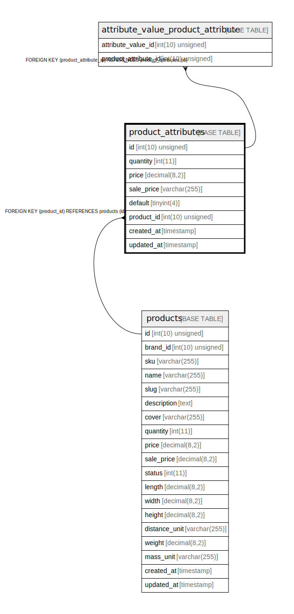

# product_attributes

## Description

<details>
<summary><strong>Table Definition</strong></summary>

```sql
CREATE TABLE `product_attributes` (
  `id` int(10) unsigned NOT NULL AUTO_INCREMENT,
  `quantity` int(11) NOT NULL,
  `price` decimal(8,2) DEFAULT NULL,
  `sale_price` varchar(255) COLLATE utf8mb4_unicode_ci DEFAULT NULL,
  `default` tinyint(4) NOT NULL DEFAULT '0',
  `product_id` int(10) unsigned NOT NULL,
  `created_at` timestamp NULL DEFAULT NULL,
  `updated_at` timestamp NULL DEFAULT NULL,
  PRIMARY KEY (`id`),
  KEY `product_attributes_product_id_foreign` (`product_id`),
  CONSTRAINT `product_attributes_product_id_foreign` FOREIGN KEY (`product_id`) REFERENCES `products` (`id`)
) ENGINE=InnoDB DEFAULT CHARSET=utf8mb4 COLLATE=utf8mb4_unicode_ci
```

</details>

## Columns

| Name | Type | Default | Nullable | Extra Definition | Children | Parents | Comment |
| ---- | ---- | ------- | -------- | --------------- | -------- | ------- | ------- |
| id | int(10) unsigned |  | false | auto_increment | [attribute_value_product_attribute](attribute_value_product_attribute.md) |  |  |
| quantity | int(11) |  | false |  |  |  |  |
| price | decimal(8,2) |  | true |  |  |  |  |
| sale_price | varchar(255) |  | true |  |  |  |  |
| default | tinyint(4) | 0 | false |  |  |  |  |
| product_id | int(10) unsigned |  | false |  |  | [products](products.md) |  |
| created_at | timestamp |  | true |  |  |  |  |
| updated_at | timestamp |  | true |  |  |  |  |

## Constraints

| Name | Type | Definition |
| ---- | ---- | ---------- |
| PRIMARY | PRIMARY KEY | PRIMARY KEY (id) |
| product_attributes_product_id_foreign | FOREIGN KEY | FOREIGN KEY (product_id) REFERENCES products (id) |

## Indexes

| Name | Definition |
| ---- | ---------- |
| product_attributes_product_id_foreign | KEY product_attributes_product_id_foreign (product_id) USING BTREE |
| PRIMARY | PRIMARY KEY (id) USING BTREE |

## Relations



---

> Generated by [tbls](https://github.com/k1LoW/tbls)
