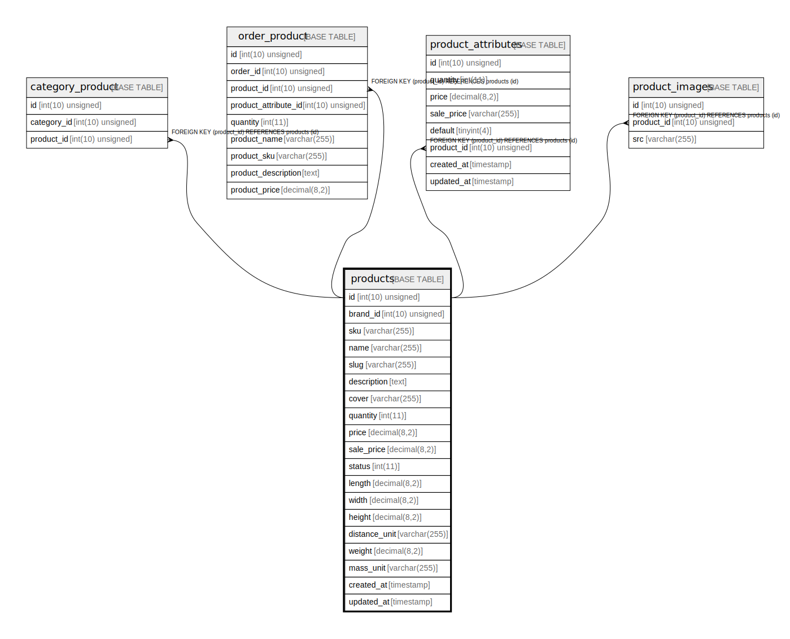

# products

## Description

<details>
<summary><strong>Table Definition</strong></summary>

```sql
CREATE TABLE `products` (
  `id` int(10) unsigned NOT NULL AUTO_INCREMENT,
  `brand_id` int(10) unsigned DEFAULT NULL,
  `sku` varchar(255) COLLATE utf8mb4_unicode_ci NOT NULL,
  `name` varchar(255) COLLATE utf8mb4_unicode_ci NOT NULL,
  `slug` varchar(255) COLLATE utf8mb4_unicode_ci NOT NULL,
  `description` text COLLATE utf8mb4_unicode_ci,
  `cover` varchar(255) COLLATE utf8mb4_unicode_ci DEFAULT NULL,
  `quantity` int(11) NOT NULL,
  `price` decimal(8,2) NOT NULL,
  `sale_price` decimal(8,2) DEFAULT NULL,
  `status` int(11) NOT NULL DEFAULT '0',
  `length` decimal(8,2) DEFAULT NULL,
  `width` decimal(8,2) DEFAULT NULL,
  `height` decimal(8,2) DEFAULT NULL,
  `distance_unit` varchar(255) COLLATE utf8mb4_unicode_ci DEFAULT NULL,
  `weight` decimal(8,2) DEFAULT '0.00',
  `mass_unit` varchar(255) COLLATE utf8mb4_unicode_ci DEFAULT NULL,
  `created_at` timestamp NULL DEFAULT NULL,
  `updated_at` timestamp NULL DEFAULT NULL,
  PRIMARY KEY (`id`)
) ENGINE=InnoDB AUTO_INCREMENT=[Redacted by tbls] DEFAULT CHARSET=utf8mb4 COLLATE=utf8mb4_unicode_ci
```

</details>

## Columns

| Name | Type | Default | Nullable | Extra Definition | Children | Parents | Comment |
| ---- | ---- | ------- | -------- | --------------- | -------- | ------- | ------- |
| id | int(10) unsigned |  | false | auto_increment | [category_product](category_product.md) [order_product](order_product.md) [product_attributes](product_attributes.md) [product_images](product_images.md) |  |  |
| brand_id | int(10) unsigned |  | true |  |  |  |  |
| sku | varchar(255) |  | false |  |  |  |  |
| name | varchar(255) |  | false |  |  |  |  |
| slug | varchar(255) |  | false |  |  |  |  |
| description | text |  | true |  |  |  |  |
| cover | varchar(255) |  | true |  |  |  |  |
| quantity | int(11) |  | false |  |  |  |  |
| price | decimal(8,2) |  | false |  |  |  |  |
| sale_price | decimal(8,2) |  | true |  |  |  |  |
| status | int(11) | 0 | false |  |  |  |  |
| length | decimal(8,2) |  | true |  |  |  |  |
| width | decimal(8,2) |  | true |  |  |  |  |
| height | decimal(8,2) |  | true |  |  |  |  |
| distance_unit | varchar(255) |  | true |  |  |  |  |
| weight | decimal(8,2) | 0.00 | true |  |  |  |  |
| mass_unit | varchar(255) |  | true |  |  |  |  |
| created_at | timestamp |  | true |  |  |  |  |
| updated_at | timestamp |  | true |  |  |  |  |

## Constraints

| Name | Type | Definition |
| ---- | ---- | ---------- |
| PRIMARY | PRIMARY KEY | PRIMARY KEY (id) |

## Indexes

| Name | Definition |
| ---- | ---------- |
| PRIMARY | PRIMARY KEY (id) USING BTREE |

## Relations



---

> Generated by [tbls](https://github.com/k1LoW/tbls)
