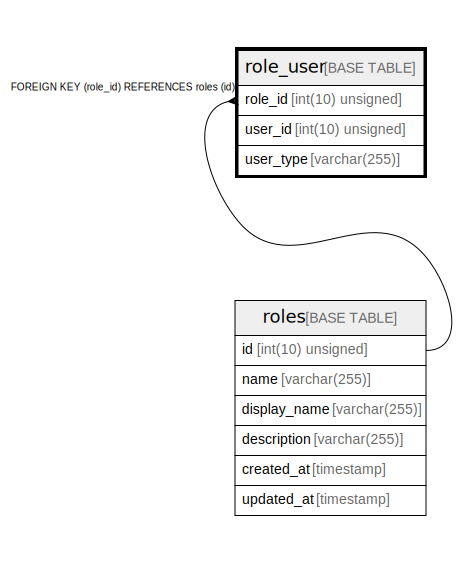

# role_user

## Description

<details>
<summary><strong>Table Definition</strong></summary>

```sql
CREATE TABLE `role_user` (
  `role_id` int(10) unsigned NOT NULL,
  `user_id` int(10) unsigned NOT NULL,
  `user_type` varchar(255) COLLATE utf8mb4_unicode_ci NOT NULL,
  PRIMARY KEY (`user_id`,`role_id`,`user_type`),
  KEY `role_user_role_id_foreign` (`role_id`),
  CONSTRAINT `role_user_role_id_foreign` FOREIGN KEY (`role_id`) REFERENCES `roles` (`id`) ON DELETE CASCADE ON UPDATE CASCADE
) ENGINE=InnoDB DEFAULT CHARSET=utf8mb4 COLLATE=utf8mb4_unicode_ci
```

</details>

## Columns

| Name | Type | Default | Nullable | Children | Parents | Comment |
| ---- | ---- | ------- | -------- | -------- | ------- | ------- |
| role_id | int(10) unsigned |  | false |  | [roles](roles.md) |  |
| user_id | int(10) unsigned |  | false |  |  |  |
| user_type | varchar(255) |  | false |  |  |  |

## Constraints

| Name | Type | Definition |
| ---- | ---- | ---------- |
| PRIMARY | PRIMARY KEY | PRIMARY KEY (user_id, role_id, user_type) |
| role_user_role_id_foreign | FOREIGN KEY | FOREIGN KEY (role_id) REFERENCES roles (id) |

## Indexes

| Name | Definition |
| ---- | ---------- |
| role_user_role_id_foreign | KEY role_user_role_id_foreign (role_id) USING BTREE |
| PRIMARY | PRIMARY KEY (user_id, role_id, user_type) USING BTREE |

## Relations



---

> Generated by [tbls](https://github.com/k1LoW/tbls)
