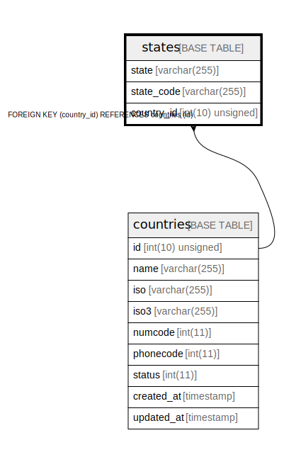

# states

## Description

<details>
<summary><strong>Table Definition</strong></summary>

```sql
CREATE TABLE `states` (
  `state` varchar(255) COLLATE utf8mb4_unicode_ci NOT NULL,
  `state_code` varchar(255) COLLATE utf8mb4_unicode_ci NOT NULL,
  `country_id` int(10) unsigned NOT NULL,
  KEY `states_country_id_foreign` (`country_id`),
  CONSTRAINT `states_country_id_foreign` FOREIGN KEY (`country_id`) REFERENCES `countries` (`id`)
) ENGINE=InnoDB DEFAULT CHARSET=utf8mb4 COLLATE=utf8mb4_unicode_ci
```

</details>

## Columns

| Name | Type | Default | Nullable | Children | Parents | Comment |
| ---- | ---- | ------- | -------- | -------- | ------- | ------- |
| state | varchar(255) |  | false |  |  |  |
| state_code | varchar(255) |  | false |  |  |  |
| country_id | int(10) unsigned |  | false |  | [countries](countries.md) |  |

## Constraints

| Name | Type | Definition |
| ---- | ---- | ---------- |
| states_country_id_foreign | FOREIGN KEY | FOREIGN KEY (country_id) REFERENCES countries (id) |

## Indexes

| Name | Definition |
| ---- | ---------- |
| states_country_id_foreign | KEY states_country_id_foreign (country_id) USING BTREE |

## Relations



---

> Generated by [tbls](https://github.com/k1LoW/tbls)
