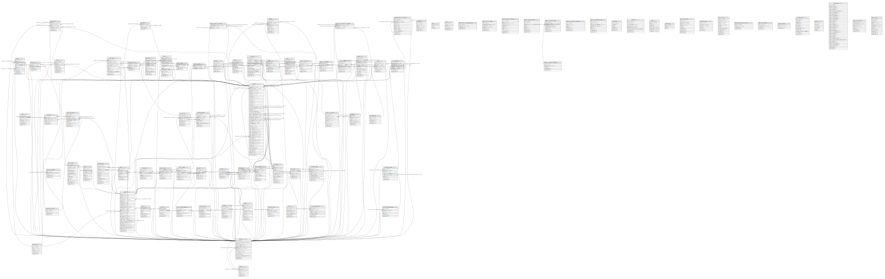

# monica

## Tables

| Name | Columns | Comment | Type |
| ---- | ------- | ------- | ---- |
| [accounts](accounts.md) | 13 |  | BASE TABLE |
| [activities](activities.md) | 8 |  | BASE TABLE |
| [activity_contact](activity_contact.md) | 3 |  | BASE TABLE |
| [activity_statistics](activity_statistics.md) | 7 |  | BASE TABLE |
| [activity_type_categories](activity_type_categories.md) | 6 |  | BASE TABLE |
| [activity_types](activity_types.md) | 8 |  | BASE TABLE |
| [address_contact_field_label](address_contact_field_label.md) | 3 |  | BASE TABLE |
| [addressbooks](addressbooks.md) | 7 |  | BASE TABLE |
| [addresses](addresses.md) | 7 |  | BASE TABLE |
| [api_usage](api_usage.md) | 6 |  | BASE TABLE |
| [audit_logs](audit_logs.md) | 11 |  | BASE TABLE |
| [cache](cache.md) | 3 |  | BASE TABLE |
| [calls](calls.md) | 8 |  | BASE TABLE |
| [companies](companies.md) | 7 |  | BASE TABLE |
| [contact_field_contact_field_label](contact_field_contact_field_label.md) | 3 |  | BASE TABLE |
| [contact_field_labels](contact_field_labels.md) | 6 |  | BASE TABLE |
| [contact_field_types](contact_field_types.md) | 9 |  | BASE TABLE |
| [contact_fields](contact_fields.md) | 7 |  | BASE TABLE |
| [contact_photo](contact_photo.md) | 4 |  | BASE TABLE |
| [contact_tag](contact_tag.md) | 5 |  | BASE TABLE |
| [contacts](contacts.md) | 47 |  | BASE TABLE |
| [conversations](conversations.md) | 7 |  | BASE TABLE |
| [crons](crons.md) | 5 |  | BASE TABLE |
| [currencies](currencies.md) | 6 |  | BASE TABLE |
| [days](days.md) | 7 |  | BASE TABLE |
| [debts](debts.md) | 10 |  | BASE TABLE |
| [default_activity_type_categories](default_activity_type_categories.md) | 4 |  | BASE TABLE |
| [default_activity_types](default_activity_types.md) | 6 |  | BASE TABLE |
| [default_contact_field_types](default_contact_field_types.md) | 9 |  | BASE TABLE |
| [default_contact_modules](default_contact_modules.md) | 8 |  | BASE TABLE |
| [default_life_event_categories](default_life_event_categories.md) | 5 |  | BASE TABLE |
| [default_life_event_types](default_life_event_types.md) | 7 |  | BASE TABLE |
| [default_relationship_type_groups](default_relationship_type_groups.md) | 6 |  | BASE TABLE |
| [default_relationship_types](default_relationship_types.md) | 8 |  | BASE TABLE |
| [documents](documents.md) | 11 |  | BASE TABLE |
| [emotion_activity](emotion_activity.md) | 5 |  | BASE TABLE |
| [emotion_call](emotion_call.md) | 6 |  | BASE TABLE |
| [emotions](emotions.md) | 6 |  | BASE TABLE |
| [emotions_primary](emotions_primary.md) | 4 |  | BASE TABLE |
| [emotions_secondary](emotions_secondary.md) | 5 |  | BASE TABLE |
| [entries](entries.md) | 6 |  | BASE TABLE |
| [failed_jobs](failed_jobs.md) | 6 |  | BASE TABLE |
| [genders](genders.md) | 6 |  | BASE TABLE |
| [gift_photo](gift_photo.md) | 4 |  | BASE TABLE |
| [gifts](gifts.md) | 13 |  | BASE TABLE |
| [import_job_reports](import_job_reports.md) | 9 |  | BASE TABLE |
| [import_jobs](import_jobs.md) | 14 |  | BASE TABLE |
| [instances](instances.md) | 8 |  | BASE TABLE |
| [invitations](invitations.md) | 7 |  | BASE TABLE |
| [jobs](jobs.md) | 7 |  | BASE TABLE |
| [journal_entries](journal_entries.md) | 7 |  | BASE TABLE |
| [life_event_categories](life_event_categories.md) | 7 |  | BASE TABLE |
| [life_event_types](life_event_types.md) | 9 |  | BASE TABLE |
| [life_events](life_events.md) | 13 |  | BASE TABLE |
| [messages](messages.md) | 9 |  | BASE TABLE |
| [metadata_love_relationships](metadata_love_relationships.md) | 11 |  | BASE TABLE |
| [migrations](migrations.md) | 3 |  | BASE TABLE |
| [modules](modules.md) | 8 |  | BASE TABLE |
| [notes](notes.md) | 8 |  | BASE TABLE |
| [oauth_access_tokens](oauth_access_tokens.md) | 9 |  | BASE TABLE |
| [oauth_auth_codes](oauth_auth_codes.md) | 6 |  | BASE TABLE |
| [oauth_clients](oauth_clients.md) | 11 |  | BASE TABLE |
| [oauth_personal_access_clients](oauth_personal_access_clients.md) | 4 |  | BASE TABLE |
| [oauth_refresh_tokens](oauth_refresh_tokens.md) | 4 |  | BASE TABLE |
| [occupations](occupations.md) | 13 |  | BASE TABLE |
| [password_resets](password_resets.md) | 3 |  | BASE TABLE |
| [pet_categories](pet_categories.md) | 5 |  | BASE TABLE |
| [pets](pets.md) | 7 |  | BASE TABLE |
| [photos](photos.md) | 8 |  | BASE TABLE |
| [places](places.md) | 11 |  | BASE TABLE |
| [recovery_codes](recovery_codes.md) | 7 |  | BASE TABLE |
| [relationship_type_groups](relationship_type_groups.md) | 6 |  | BASE TABLE |
| [relationship_types](relationship_types.md) | 8 |  | BASE TABLE |
| [relationships](relationships.md) | 7 |  | BASE TABLE |
| [reminder_outbox](reminder_outbox.md) | 9 |  | BASE TABLE |
| [reminder_rules](reminder_rules.md) | 6 |  | BASE TABLE |
| [reminders](reminders.md) | 12 |  | BASE TABLE |
| [reminders_sent](reminders_sent.md) | 11 |  | BASE TABLE |
| [sessions](sessions.md) | 6 |  | BASE TABLE |
| [special_dates](special_dates.md) | 9 |  | BASE TABLE |
| [statistics](statistics.md) | 30 |  | BASE TABLE |
| [subscription_items](subscription_items.md) | 7 |  | BASE TABLE |
| [subscriptions](subscriptions.md) | 11 |  | BASE TABLE |
| [synctoken](synctoken.md) | 7 |  | BASE TABLE |
| [tags](tags.md) | 7 |  | BASE TABLE |
| [tasks](tasks.md) | 10 |  | BASE TABLE |
| [term_user](term_user.md) | 6 |  | BASE TABLE |
| [terms](terms.md) | 7 |  | BASE TABLE |
| [u2f_key](u2f_key.md) | 9 |  | BASE TABLE |
| [users](users.md) | 26 |  | BASE TABLE |
| [weather](weather.md) | 6 |  | BASE TABLE |
| [webauthn_keys](webauthn_keys.md) | 13 |  | BASE TABLE |

## Relations

---

> Generated by [tbls](https://github.com/k1LoW/tbls)
