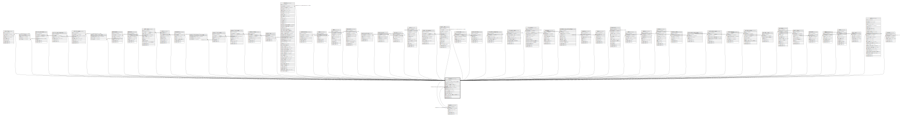

# accounts

## Description

<details>
<summary><strong>Table Definition</strong></summary>

```sql
CREATE TABLE `accounts` (
  `id` int(10) unsigned NOT NULL AUTO_INCREMENT,
  `has_access_to_paid_version_for_free` tinyint(1) NOT NULL DEFAULT '0',
  `api_key` varchar(255) COLLATE utf8mb4_unicode_ci NOT NULL,
  `number_of_invitations_sent` int(11) DEFAULT NULL,
  `default_time_reminder_is_sent` varchar(255) COLLATE utf8mb4_unicode_ci NOT NULL DEFAULT '12:00',
  `default_gender_id` int(10) unsigned DEFAULT NULL,
  `stripe_id` varchar(255) COLLATE utf8mb4_unicode_ci DEFAULT NULL,
  `card_brand` varchar(255) COLLATE utf8mb4_unicode_ci DEFAULT NULL,
  `card_last_four` varchar(4) COLLATE utf8mb4_unicode_ci DEFAULT NULL,
  `trial_ends_at` timestamp NULL DEFAULT NULL,
  `legacy_free_plan_unlimited_contacts` tinyint(1) NOT NULL DEFAULT '0',
  `created_at` timestamp NULL DEFAULT NULL,
  `updated_at` timestamp NULL DEFAULT NULL,
  PRIMARY KEY (`id`),
  KEY `accounts_default_gender_id_foreign` (`default_gender_id`),
  KEY `accounts_stripe_id_index` (`stripe_id`),
  CONSTRAINT `accounts_default_gender_id_foreign` FOREIGN KEY (`default_gender_id`) REFERENCES `genders` (`id`) ON DELETE SET NULL
) ENGINE=InnoDB DEFAULT CHARSET=utf8mb4 COLLATE=utf8mb4_unicode_ci
```

</details>

## Columns

| Name | Type | Default | Nullable | Extra Definition | Children | Parents | Comment |
| ---- | ---- | ------- | -------- | --------------- | -------- | ------- | ------- |
| id | int(10) unsigned |  | false | auto_increment | [activities](activities.md) [activity_contact](activity_contact.md) [activity_statistics](activity_statistics.md) [activity_type_categories](activity_type_categories.md) [activity_types](activity_types.md) [address_contact_field_label](address_contact_field_label.md) [addressbooks](addressbooks.md) [addresses](addresses.md) [audit_logs](audit_logs.md) [calls](calls.md) [companies](companies.md) [contact_field_contact_field_label](contact_field_contact_field_label.md) [contact_field_labels](contact_field_labels.md) [contact_field_types](contact_field_types.md) [contact_fields](contact_fields.md) [contact_tag](contact_tag.md) [contacts](contacts.md) [conversations](conversations.md) [days](days.md) [debts](debts.md) [documents](documents.md) [emotion_activity](emotion_activity.md) [emotion_call](emotion_call.md) [entries](entries.md) [genders](genders.md) [gifts](gifts.md) [import_job_reports](import_job_reports.md) [import_jobs](import_jobs.md) [invitations](invitations.md) [journal_entries](journal_entries.md) [life_event_categories](life_event_categories.md) [life_event_types](life_event_types.md) [life_events](life_events.md) [messages](messages.md) [metadata_love_relationships](metadata_love_relationships.md) [modules](modules.md) [notes](notes.md) [occupations](occupations.md) [pets](pets.md) [photos](photos.md) [places](places.md) [recovery_codes](recovery_codes.md) [relationship_type_groups](relationship_type_groups.md) [relationship_types](relationship_types.md) [relationships](relationships.md) [reminder_outbox](reminder_outbox.md) [reminder_rules](reminder_rules.md) [reminders](reminders.md) [special_dates](special_dates.md) [synctoken](synctoken.md) [tags](tags.md) [tasks](tasks.md) [term_user](term_user.md) [users](users.md) [weather](weather.md) |  |  |
| has_access_to_paid_version_for_free | tinyint(1) | 0 | false |  |  |  |  |
| api_key | varchar(255) |  | false |  |  |  |  |
| number_of_invitations_sent | int(11) |  | true |  |  |  |  |
| default_time_reminder_is_sent | varchar(255) | 12:00 | false |  |  |  |  |
| default_gender_id | int(10) unsigned |  | true |  |  | [genders](genders.md) |  |
| stripe_id | varchar(255) |  | true |  |  |  |  |
| card_brand | varchar(255) |  | true |  |  |  |  |
| card_last_four | varchar(4) |  | true |  |  |  |  |
| trial_ends_at | timestamp |  | true |  |  |  |  |
| legacy_free_plan_unlimited_contacts | tinyint(1) | 0 | false |  |  |  |  |
| created_at | timestamp |  | true |  |  |  |  |
| updated_at | timestamp |  | true |  |  |  |  |

## Constraints

| Name | Type | Definition |
| ---- | ---- | ---------- |
| accounts_default_gender_id_foreign | FOREIGN KEY | FOREIGN KEY (default_gender_id) REFERENCES genders (id) |
| PRIMARY | PRIMARY KEY | PRIMARY KEY (id) |

## Indexes

| Name | Definition |
| ---- | ---------- |
| accounts_default_gender_id_foreign | KEY accounts_default_gender_id_foreign (default_gender_id) USING BTREE |
| accounts_stripe_id_index | KEY accounts_stripe_id_index (stripe_id) USING BTREE |
| PRIMARY | PRIMARY KEY (id) USING BTREE |

## Relations



---

> Generated by [tbls](https://github.com/k1LoW/tbls)
