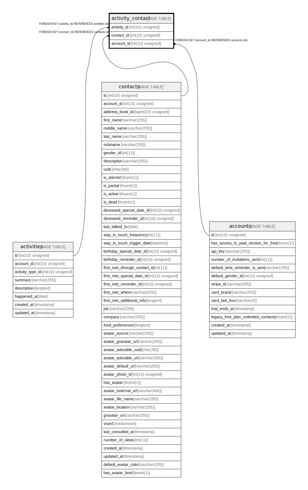

# activity_contact

## Description

<details>
<summary><strong>Table Definition</strong></summary>

```sql
CREATE TABLE `activity_contact` (
  `activity_id` int(10) unsigned NOT NULL,
  `contact_id` int(10) unsigned NOT NULL,
  `account_id` int(10) unsigned NOT NULL,
  KEY `activity_contact_activity_id_foreign` (`activity_id`),
  KEY `activity_contact_contact_id_foreign` (`contact_id`),
  KEY `activity_contact_account_id_foreign` (`account_id`),
  CONSTRAINT `activity_contact_account_id_foreign` FOREIGN KEY (`account_id`) REFERENCES `accounts` (`id`) ON DELETE CASCADE,
  CONSTRAINT `activity_contact_activity_id_foreign` FOREIGN KEY (`activity_id`) REFERENCES `activities` (`id`) ON DELETE CASCADE,
  CONSTRAINT `activity_contact_contact_id_foreign` FOREIGN KEY (`contact_id`) REFERENCES `contacts` (`id`) ON DELETE CASCADE
) ENGINE=InnoDB DEFAULT CHARSET=utf8mb4 COLLATE=utf8mb4_unicode_ci
```

</details>

## Columns

| Name | Type | Default | Nullable | Children | Parents | Comment |
| ---- | ---- | ------- | -------- | -------- | ------- | ------- |
| activity_id | int(10) unsigned |  | false |  | [activities](activities.md) |  |
| contact_id | int(10) unsigned |  | false |  | [contacts](contacts.md) |  |
| account_id | int(10) unsigned |  | false |  | [accounts](accounts.md) |  |

## Constraints

| Name | Type | Definition |
| ---- | ---- | ---------- |
| activity_contact_account_id_foreign | FOREIGN KEY | FOREIGN KEY (account_id) REFERENCES accounts (id) |
| activity_contact_activity_id_foreign | FOREIGN KEY | FOREIGN KEY (activity_id) REFERENCES activities (id) |
| activity_contact_contact_id_foreign | FOREIGN KEY | FOREIGN KEY (contact_id) REFERENCES contacts (id) |

## Indexes

| Name | Definition |
| ---- | ---------- |
| activity_contact_account_id_foreign | KEY activity_contact_account_id_foreign (account_id) USING BTREE |
| activity_contact_activity_id_foreign | KEY activity_contact_activity_id_foreign (activity_id) USING BTREE |
| activity_contact_contact_id_foreign | KEY activity_contact_contact_id_foreign (contact_id) USING BTREE |

## Relations



---

> Generated by [tbls](https://github.com/k1LoW/tbls)
