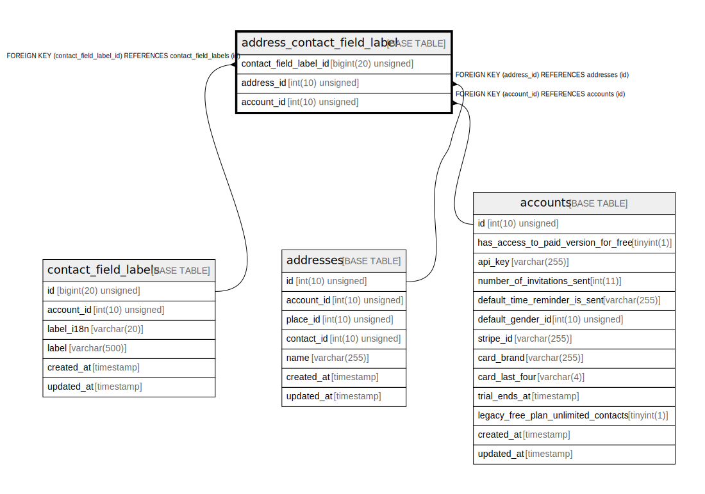

# address_contact_field_label

## Description

<details>
<summary><strong>Table Definition</strong></summary>

```sql
CREATE TABLE `address_contact_field_label` (
  `contact_field_label_id` bigint(20) unsigned NOT NULL,
  `address_id` int(10) unsigned NOT NULL,
  `account_id` int(10) unsigned NOT NULL,
  KEY `address_contact_field_label_index` (`contact_field_label_id`,`address_id`,`account_id`),
  KEY `address_contact_field_label_address_id_foreign` (`address_id`),
  KEY `address_contact_field_label_account_id_foreign` (`account_id`),
  CONSTRAINT `address_contact_field_label_account_id_foreign` FOREIGN KEY (`account_id`) REFERENCES `accounts` (`id`) ON DELETE CASCADE,
  CONSTRAINT `address_contact_field_label_address_id_foreign` FOREIGN KEY (`address_id`) REFERENCES `addresses` (`id`) ON DELETE CASCADE,
  CONSTRAINT `address_contact_field_label_contact_field_label_id_foreign` FOREIGN KEY (`contact_field_label_id`) REFERENCES `contact_field_labels` (`id`) ON DELETE CASCADE
) ENGINE=InnoDB DEFAULT CHARSET=utf8mb4 COLLATE=utf8mb4_unicode_ci
```

</details>

## Columns

| Name | Type | Default | Nullable | Children | Parents | Comment |
| ---- | ---- | ------- | -------- | -------- | ------- | ------- |
| contact_field_label_id | bigint(20) unsigned |  | false |  | [contact_field_labels](contact_field_labels.md) |  |
| address_id | int(10) unsigned |  | false |  | [addresses](addresses.md) |  |
| account_id | int(10) unsigned |  | false |  | [accounts](accounts.md) |  |

## Constraints

| Name | Type | Definition |
| ---- | ---- | ---------- |
| address_contact_field_label_account_id_foreign | FOREIGN KEY | FOREIGN KEY (account_id) REFERENCES accounts (id) |
| address_contact_field_label_address_id_foreign | FOREIGN KEY | FOREIGN KEY (address_id) REFERENCES addresses (id) |
| address_contact_field_label_contact_field_label_id_foreign | FOREIGN KEY | FOREIGN KEY (contact_field_label_id) REFERENCES contact_field_labels (id) |

## Indexes

| Name | Definition |
| ---- | ---------- |
| address_contact_field_label_account_id_foreign | KEY address_contact_field_label_account_id_foreign (account_id) USING BTREE |
| address_contact_field_label_address_id_foreign | KEY address_contact_field_label_address_id_foreign (address_id) USING BTREE |
| address_contact_field_label_index | KEY address_contact_field_label_index (contact_field_label_id, address_id, account_id) USING BTREE |

## Relations



---

> Generated by [tbls](https://github.com/k1LoW/tbls)
