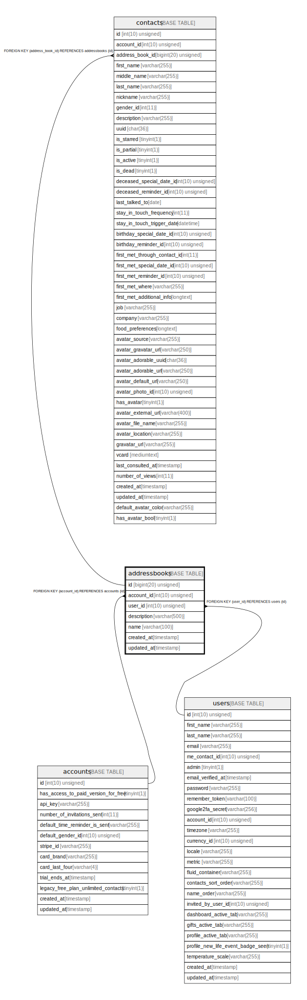

# addressbooks

## Description

<details>
<summary><strong>Table Definition</strong></summary>

```sql
CREATE TABLE `addressbooks` (
  `id` bigint(20) unsigned NOT NULL AUTO_INCREMENT,
  `account_id` int(10) unsigned NOT NULL,
  `user_id` int(10) unsigned NOT NULL,
  `description` varchar(500) COLLATE utf8mb4_unicode_ci DEFAULT NULL,
  `name` varchar(100) COLLATE utf8mb4_unicode_ci NOT NULL,
  `created_at` timestamp NULL DEFAULT NULL,
  `updated_at` timestamp NULL DEFAULT NULL,
  PRIMARY KEY (`id`),
  KEY `addressbooks_name_index` (`name`),
  KEY `addressbooks_account_id_foreign` (`account_id`),
  KEY `addressbooks_user_id_foreign` (`user_id`),
  CONSTRAINT `addressbooks_account_id_foreign` FOREIGN KEY (`account_id`) REFERENCES `accounts` (`id`) ON DELETE CASCADE,
  CONSTRAINT `addressbooks_user_id_foreign` FOREIGN KEY (`user_id`) REFERENCES `users` (`id`) ON DELETE CASCADE
) ENGINE=InnoDB DEFAULT CHARSET=utf8mb4 COLLATE=utf8mb4_unicode_ci
```

</details>

## Columns

| Name | Type | Default | Nullable | Extra Definition | Children | Parents | Comment |
| ---- | ---- | ------- | -------- | --------------- | -------- | ------- | ------- |
| id | bigint(20) unsigned |  | false | auto_increment | [contacts](contacts.md) |  |  |
| account_id | int(10) unsigned |  | false |  |  | [accounts](accounts.md) |  |
| user_id | int(10) unsigned |  | false |  |  | [users](users.md) |  |
| description | varchar(500) |  | true |  |  |  |  |
| name | varchar(100) |  | false |  |  |  |  |
| created_at | timestamp |  | true |  |  |  |  |
| updated_at | timestamp |  | true |  |  |  |  |

## Constraints

| Name | Type | Definition |
| ---- | ---- | ---------- |
| addressbooks_account_id_foreign | FOREIGN KEY | FOREIGN KEY (account_id) REFERENCES accounts (id) |
| addressbooks_user_id_foreign | FOREIGN KEY | FOREIGN KEY (user_id) REFERENCES users (id) |
| PRIMARY | PRIMARY KEY | PRIMARY KEY (id) |

## Indexes

| Name | Definition |
| ---- | ---------- |
| addressbooks_account_id_foreign | KEY addressbooks_account_id_foreign (account_id) USING BTREE |
| addressbooks_name_index | KEY addressbooks_name_index (name) USING BTREE |
| addressbooks_user_id_foreign | KEY addressbooks_user_id_foreign (user_id) USING BTREE |
| PRIMARY | PRIMARY KEY (id) USING BTREE |

## Relations



---

> Generated by [tbls](https://github.com/k1LoW/tbls)
