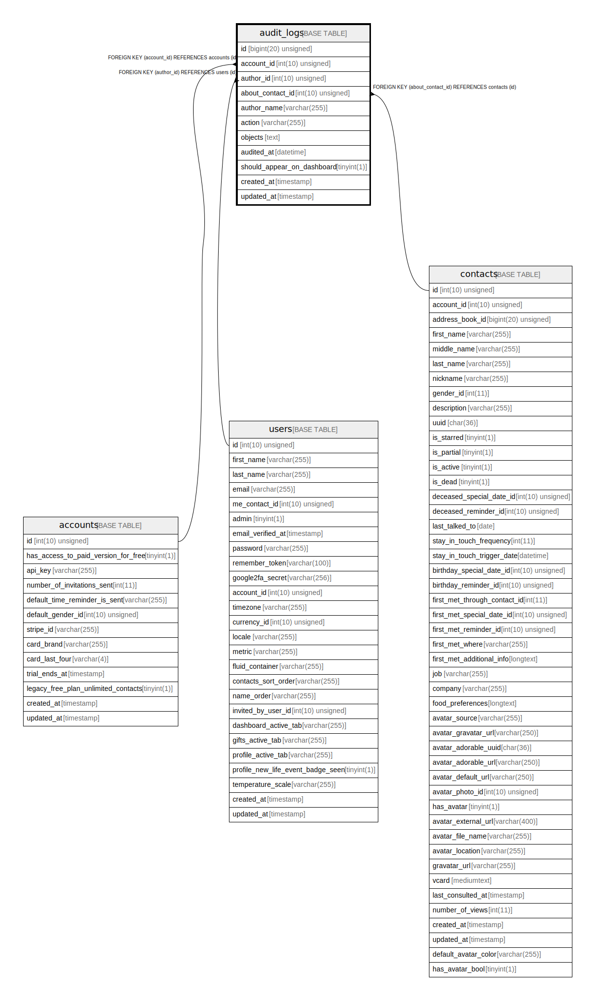

# audit_logs

## Description

<details>
<summary><strong>Table Definition</strong></summary>

```sql
CREATE TABLE `audit_logs` (
  `id` bigint(20) unsigned NOT NULL AUTO_INCREMENT,
  `account_id` int(10) unsigned NOT NULL,
  `author_id` int(10) unsigned DEFAULT NULL,
  `about_contact_id` int(10) unsigned DEFAULT NULL,
  `author_name` varchar(255) COLLATE utf8mb4_unicode_ci NOT NULL,
  `action` varchar(255) COLLATE utf8mb4_unicode_ci NOT NULL,
  `objects` text COLLATE utf8mb4_unicode_ci NOT NULL,
  `audited_at` datetime NOT NULL,
  `should_appear_on_dashboard` tinyint(1) NOT NULL DEFAULT '0',
  `created_at` timestamp NULL DEFAULT NULL,
  `updated_at` timestamp NULL DEFAULT NULL,
  PRIMARY KEY (`id`),
  KEY `audit_logs_account_id_foreign` (`account_id`),
  KEY `audit_logs_author_id_foreign` (`author_id`),
  KEY `audit_logs_about_contact_id_foreign` (`about_contact_id`),
  CONSTRAINT `audit_logs_about_contact_id_foreign` FOREIGN KEY (`about_contact_id`) REFERENCES `contacts` (`id`) ON DELETE SET NULL,
  CONSTRAINT `audit_logs_account_id_foreign` FOREIGN KEY (`account_id`) REFERENCES `accounts` (`id`) ON DELETE CASCADE,
  CONSTRAINT `audit_logs_author_id_foreign` FOREIGN KEY (`author_id`) REFERENCES `users` (`id`) ON DELETE SET NULL
) ENGINE=InnoDB DEFAULT CHARSET=utf8mb4 COLLATE=utf8mb4_unicode_ci
```

</details>

## Columns

| Name | Type | Default | Nullable | Extra Definition | Children | Parents | Comment |
| ---- | ---- | ------- | -------- | --------------- | -------- | ------- | ------- |
| id | bigint(20) unsigned |  | false | auto_increment |  |  |  |
| account_id | int(10) unsigned |  | false |  |  | [accounts](accounts.md) |  |
| author_id | int(10) unsigned |  | true |  |  | [users](users.md) |  |
| about_contact_id | int(10) unsigned |  | true |  |  | [contacts](contacts.md) |  |
| author_name | varchar(255) |  | false |  |  |  |  |
| action | varchar(255) |  | false |  |  |  |  |
| objects | text |  | false |  |  |  |  |
| audited_at | datetime |  | false |  |  |  |  |
| should_appear_on_dashboard | tinyint(1) | 0 | false |  |  |  |  |
| created_at | timestamp |  | true |  |  |  |  |
| updated_at | timestamp |  | true |  |  |  |  |

## Constraints

| Name | Type | Definition |
| ---- | ---- | ---------- |
| audit_logs_about_contact_id_foreign | FOREIGN KEY | FOREIGN KEY (about_contact_id) REFERENCES contacts (id) |
| audit_logs_account_id_foreign | FOREIGN KEY | FOREIGN KEY (account_id) REFERENCES accounts (id) |
| audit_logs_author_id_foreign | FOREIGN KEY | FOREIGN KEY (author_id) REFERENCES users (id) |
| PRIMARY | PRIMARY KEY | PRIMARY KEY (id) |

## Indexes

| Name | Definition |
| ---- | ---------- |
| audit_logs_about_contact_id_foreign | KEY audit_logs_about_contact_id_foreign (about_contact_id) USING BTREE |
| audit_logs_account_id_foreign | KEY audit_logs_account_id_foreign (account_id) USING BTREE |
| audit_logs_author_id_foreign | KEY audit_logs_author_id_foreign (author_id) USING BTREE |
| PRIMARY | PRIMARY KEY (id) USING BTREE |

## Relations



---

> Generated by [tbls](https://github.com/k1LoW/tbls)
