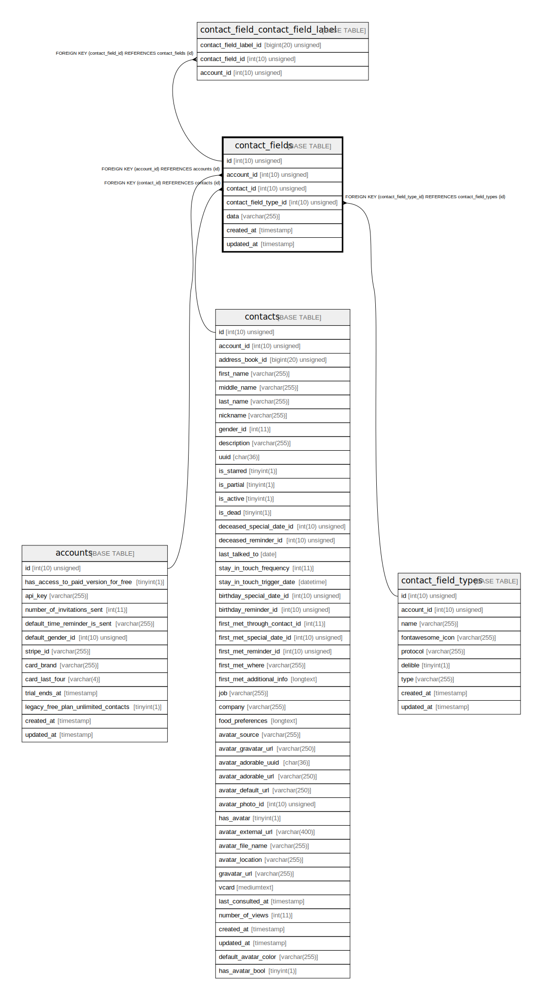

# contact_fields

## Description

<details>
<summary><strong>Table Definition</strong></summary>

```sql
CREATE TABLE `contact_fields` (
  `id` int(10) unsigned NOT NULL AUTO_INCREMENT,
  `account_id` int(10) unsigned NOT NULL,
  `contact_id` int(10) unsigned NOT NULL,
  `contact_field_type_id` int(10) unsigned NOT NULL,
  `data` varchar(255) COLLATE utf8mb4_unicode_ci NOT NULL,
  `created_at` timestamp NULL DEFAULT NULL,
  `updated_at` timestamp NULL DEFAULT NULL,
  PRIMARY KEY (`id`),
  KEY `contact_fields_account_id_foreign` (`account_id`),
  KEY `contact_fields_contact_id_foreign` (`contact_id`),
  KEY `contact_fields_contact_field_type_id_foreign` (`contact_field_type_id`),
  CONSTRAINT `contact_fields_account_id_foreign` FOREIGN KEY (`account_id`) REFERENCES `accounts` (`id`) ON DELETE CASCADE,
  CONSTRAINT `contact_fields_contact_field_type_id_foreign` FOREIGN KEY (`contact_field_type_id`) REFERENCES `contact_field_types` (`id`) ON DELETE CASCADE,
  CONSTRAINT `contact_fields_contact_id_foreign` FOREIGN KEY (`contact_id`) REFERENCES `contacts` (`id`) ON DELETE CASCADE
) ENGINE=InnoDB DEFAULT CHARSET=utf8mb4 COLLATE=utf8mb4_unicode_ci
```

</details>

## Columns

| Name | Type | Default | Nullable | Extra Definition | Children | Parents | Comment |
| ---- | ---- | ------- | -------- | --------------- | -------- | ------- | ------- |
| id | int(10) unsigned |  | false | auto_increment | [contact_field_contact_field_label](contact_field_contact_field_label.md) |  |  |
| account_id | int(10) unsigned |  | false |  |  | [accounts](accounts.md) |  |
| contact_id | int(10) unsigned |  | false |  |  | [contacts](contacts.md) |  |
| contact_field_type_id | int(10) unsigned |  | false |  |  | [contact_field_types](contact_field_types.md) |  |
| data | varchar(255) |  | false |  |  |  |  |
| created_at | timestamp |  | true |  |  |  |  |
| updated_at | timestamp |  | true |  |  |  |  |

## Constraints

| Name | Type | Definition |
| ---- | ---- | ---------- |
| contact_fields_account_id_foreign | FOREIGN KEY | FOREIGN KEY (account_id) REFERENCES accounts (id) |
| contact_fields_contact_field_type_id_foreign | FOREIGN KEY | FOREIGN KEY (contact_field_type_id) REFERENCES contact_field_types (id) |
| contact_fields_contact_id_foreign | FOREIGN KEY | FOREIGN KEY (contact_id) REFERENCES contacts (id) |
| PRIMARY | PRIMARY KEY | PRIMARY KEY (id) |

## Indexes

| Name | Definition |
| ---- | ---------- |
| contact_fields_account_id_foreign | KEY contact_fields_account_id_foreign (account_id) USING BTREE |
| contact_fields_contact_field_type_id_foreign | KEY contact_fields_contact_field_type_id_foreign (contact_field_type_id) USING BTREE |
| contact_fields_contact_id_foreign | KEY contact_fields_contact_id_foreign (contact_id) USING BTREE |
| PRIMARY | PRIMARY KEY (id) USING BTREE |

## Relations



---

> Generated by [tbls](https://github.com/k1LoW/tbls)
