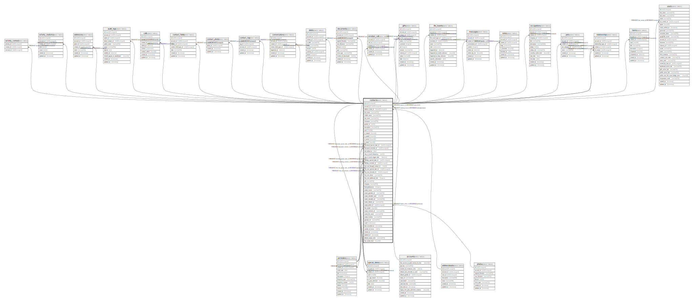

# contacts

## Description

<details>
<summary><strong>Table Definition</strong></summary>

```sql
CREATE TABLE `contacts` (
  `id` int(10) unsigned NOT NULL AUTO_INCREMENT,
  `account_id` int(10) unsigned NOT NULL,
  `address_book_id` bigint(20) unsigned DEFAULT NULL,
  `first_name` varchar(255) COLLATE utf8mb4_unicode_ci NOT NULL,
  `middle_name` varchar(255) COLLATE utf8mb4_unicode_ci DEFAULT NULL,
  `last_name` varchar(255) COLLATE utf8mb4_unicode_ci DEFAULT NULL,
  `nickname` varchar(255) COLLATE utf8mb4_unicode_ci DEFAULT NULL,
  `gender_id` int(11) DEFAULT NULL,
  `description` varchar(255) COLLATE utf8mb4_unicode_ci DEFAULT NULL,
  `uuid` char(36) COLLATE utf8mb4_unicode_ci DEFAULT NULL,
  `is_starred` tinyint(1) NOT NULL DEFAULT '0',
  `is_partial` tinyint(1) NOT NULL DEFAULT '0',
  `is_active` tinyint(1) NOT NULL DEFAULT '1',
  `is_dead` tinyint(1) NOT NULL DEFAULT '0',
  `deceased_special_date_id` int(10) unsigned DEFAULT NULL,
  `deceased_reminder_id` int(10) unsigned DEFAULT NULL,
  `last_talked_to` date DEFAULT NULL,
  `stay_in_touch_frequency` int(11) DEFAULT NULL,
  `stay_in_touch_trigger_date` datetime DEFAULT NULL,
  `birthday_special_date_id` int(10) unsigned DEFAULT NULL,
  `birthday_reminder_id` int(10) unsigned DEFAULT NULL,
  `first_met_through_contact_id` int(11) DEFAULT NULL,
  `first_met_special_date_id` int(10) unsigned DEFAULT NULL,
  `first_met_reminder_id` int(10) unsigned DEFAULT NULL,
  `first_met_where` varchar(255) COLLATE utf8mb4_unicode_ci DEFAULT NULL,
  `first_met_additional_info` longtext COLLATE utf8mb4_unicode_ci,
  `job` varchar(255) COLLATE utf8mb4_unicode_ci DEFAULT NULL,
  `company` varchar(255) COLLATE utf8mb4_unicode_ci DEFAULT NULL,
  `food_preferences` longtext COLLATE utf8mb4_unicode_ci,
  `avatar_source` varchar(255) COLLATE utf8mb4_unicode_ci NOT NULL DEFAULT 'default',
  `avatar_gravatar_url` varchar(250) COLLATE utf8mb4_unicode_ci DEFAULT NULL,
  `avatar_adorable_uuid` char(36) COLLATE utf8mb4_unicode_ci DEFAULT NULL,
  `avatar_adorable_url` varchar(250) COLLATE utf8mb4_unicode_ci DEFAULT NULL,
  `avatar_default_url` varchar(250) COLLATE utf8mb4_unicode_ci DEFAULT NULL,
  `avatar_photo_id` int(10) unsigned DEFAULT NULL,
  `has_avatar` tinyint(1) NOT NULL DEFAULT '0',
  `avatar_external_url` varchar(400) COLLATE utf8mb4_unicode_ci DEFAULT NULL,
  `avatar_file_name` varchar(255) COLLATE utf8mb4_unicode_ci DEFAULT NULL,
  `avatar_location` varchar(255) COLLATE utf8mb4_unicode_ci NOT NULL DEFAULT 'local',
  `gravatar_url` varchar(255) COLLATE utf8mb4_unicode_ci DEFAULT NULL,
  `vcard` mediumtext COLLATE utf8mb4_unicode_ci,
  `last_consulted_at` timestamp NULL DEFAULT NULL,
  `number_of_views` int(11) NOT NULL DEFAULT '0',
  `created_at` timestamp NULL DEFAULT NULL,
  `updated_at` timestamp NULL DEFAULT NULL,
  `default_avatar_color` varchar(255) COLLATE utf8mb4_unicode_ci NOT NULL,
  `has_avatar_bool` tinyint(1) NOT NULL DEFAULT '0',
  PRIMARY KEY (`id`),
  KEY `contacts_birthday_reminder_id_foreign` (`birthday_reminder_id`),
  KEY `contacts_first_met_reminder_id_foreign` (`first_met_reminder_id`),
  KEY `contacts_deceased_reminder_id_foreign` (`deceased_reminder_id`),
  KEY `contacts_birthday_special_date_id_foreign` (`birthday_special_date_id`),
  KEY `contacts_first_met_special_date_id_foreign` (`first_met_special_date_id`),
  KEY `contacts_deceased_special_date_id_foreign` (`deceased_special_date_id`),
  KEY `contacts_account_id_uuid_index` (`account_id`,`uuid`),
  KEY `contacts_avatar_photo_id_foreign` (`avatar_photo_id`),
  KEY `contacts_address_book_id_foreign` (`address_book_id`),
  CONSTRAINT `contacts_account_id_foreign` FOREIGN KEY (`account_id`) REFERENCES `accounts` (`id`) ON DELETE CASCADE,
  CONSTRAINT `contacts_address_book_id_foreign` FOREIGN KEY (`address_book_id`) REFERENCES `addressbooks` (`id`) ON DELETE CASCADE,
  CONSTRAINT `contacts_avatar_photo_id_foreign` FOREIGN KEY (`avatar_photo_id`) REFERENCES `photos` (`id`) ON DELETE SET NULL,
  CONSTRAINT `contacts_birthday_reminder_id_foreign` FOREIGN KEY (`birthday_reminder_id`) REFERENCES `reminders` (`id`) ON DELETE SET NULL,
  CONSTRAINT `contacts_birthday_special_date_id_foreign` FOREIGN KEY (`birthday_special_date_id`) REFERENCES `special_dates` (`id`) ON DELETE SET NULL,
  CONSTRAINT `contacts_deceased_reminder_id_foreign` FOREIGN KEY (`deceased_reminder_id`) REFERENCES `reminders` (`id`) ON DELETE SET NULL,
  CONSTRAINT `contacts_deceased_special_date_id_foreign` FOREIGN KEY (`deceased_special_date_id`) REFERENCES `special_dates` (`id`) ON DELETE SET NULL,
  CONSTRAINT `contacts_first_met_reminder_id_foreign` FOREIGN KEY (`first_met_reminder_id`) REFERENCES `reminders` (`id`) ON DELETE SET NULL,
  CONSTRAINT `contacts_first_met_special_date_id_foreign` FOREIGN KEY (`first_met_special_date_id`) REFERENCES `special_dates` (`id`) ON DELETE SET NULL
) ENGINE=InnoDB DEFAULT CHARSET=utf8mb4 COLLATE=utf8mb4_unicode_ci
```

</details>

## Columns

| Name | Type | Default | Nullable | Extra Definition | Children | Parents | Comment |
| ---- | ---- | ------- | -------- | --------------- | -------- | ------- | ------- |
| id | int(10) unsigned |  | false | auto_increment | [activity_contact](activity_contact.md) [activity_statistics](activity_statistics.md) [addresses](addresses.md) [audit_logs](audit_logs.md) [calls](calls.md) [contact_fields](contact_fields.md) [contact_photo](contact_photo.md) [contact_tag](contact_tag.md) [conversations](conversations.md) [debts](debts.md) [documents](documents.md) [emotion_call](emotion_call.md) [gifts](gifts.md) [life_events](life_events.md) [messages](messages.md) [notes](notes.md) [occupations](occupations.md) [pets](pets.md) [relationships](relationships.md) [reminders](reminders.md) [special_dates](special_dates.md) [tasks](tasks.md) [users](users.md) |  |  |
| account_id | int(10) unsigned |  | false |  |  | [accounts](accounts.md) |  |
| address_book_id | bigint(20) unsigned |  | true |  |  | [addressbooks](addressbooks.md) |  |
| first_name | varchar(255) |  | false |  |  |  |  |
| middle_name | varchar(255) |  | true |  |  |  |  |
| last_name | varchar(255) |  | true |  |  |  |  |
| nickname | varchar(255) |  | true |  |  |  |  |
| gender_id | int(11) |  | true |  |  |  |  |
| description | varchar(255) |  | true |  |  |  |  |
| uuid | char(36) |  | true |  |  |  |  |
| is_starred | tinyint(1) | 0 | false |  |  |  |  |
| is_partial | tinyint(1) | 0 | false |  |  |  |  |
| is_active | tinyint(1) | 1 | false |  |  |  |  |
| is_dead | tinyint(1) | 0 | false |  |  |  |  |
| deceased_special_date_id | int(10) unsigned |  | true |  |  | [special_dates](special_dates.md) |  |
| deceased_reminder_id | int(10) unsigned |  | true |  |  | [reminders](reminders.md) |  |
| last_talked_to | date |  | true |  |  |  |  |
| stay_in_touch_frequency | int(11) |  | true |  |  |  |  |
| stay_in_touch_trigger_date | datetime |  | true |  |  |  |  |
| birthday_special_date_id | int(10) unsigned |  | true |  |  | [special_dates](special_dates.md) |  |
| birthday_reminder_id | int(10) unsigned |  | true |  |  | [reminders](reminders.md) |  |
| first_met_through_contact_id | int(11) |  | true |  |  |  |  |
| first_met_special_date_id | int(10) unsigned |  | true |  |  | [special_dates](special_dates.md) |  |
| first_met_reminder_id | int(10) unsigned |  | true |  |  | [reminders](reminders.md) |  |
| first_met_where | varchar(255) |  | true |  |  |  |  |
| first_met_additional_info | longtext |  | true |  |  |  |  |
| job | varchar(255) |  | true |  |  |  |  |
| company | varchar(255) |  | true |  |  |  |  |
| food_preferences | longtext |  | true |  |  |  |  |
| avatar_source | varchar(255) | default | false |  |  |  |  |
| avatar_gravatar_url | varchar(250) |  | true |  |  |  |  |
| avatar_adorable_uuid | char(36) |  | true |  |  |  |  |
| avatar_adorable_url | varchar(250) |  | true |  |  |  |  |
| avatar_default_url | varchar(250) |  | true |  |  |  |  |
| avatar_photo_id | int(10) unsigned |  | true |  |  | [photos](photos.md) |  |
| has_avatar | tinyint(1) | 0 | false |  |  |  |  |
| avatar_external_url | varchar(400) |  | true |  |  |  |  |
| avatar_file_name | varchar(255) |  | true |  |  |  |  |
| avatar_location | varchar(255) | local | false |  |  |  |  |
| gravatar_url | varchar(255) |  | true |  |  |  |  |
| vcard | mediumtext |  | true |  |  |  |  |
| last_consulted_at | timestamp |  | true |  |  |  |  |
| number_of_views | int(11) | 0 | false |  |  |  |  |
| created_at | timestamp |  | true |  |  |  |  |
| updated_at | timestamp |  | true |  |  |  |  |
| default_avatar_color | varchar(255) |  | false |  |  |  |  |
| has_avatar_bool | tinyint(1) | 0 | false |  |  |  |  |

## Constraints

| Name | Type | Definition |
| ---- | ---- | ---------- |
| contacts_account_id_foreign | FOREIGN KEY | FOREIGN KEY (account_id) REFERENCES accounts (id) |
| contacts_address_book_id_foreign | FOREIGN KEY | FOREIGN KEY (address_book_id) REFERENCES addressbooks (id) |
| contacts_avatar_photo_id_foreign | FOREIGN KEY | FOREIGN KEY (avatar_photo_id) REFERENCES photos (id) |
| contacts_birthday_reminder_id_foreign | FOREIGN KEY | FOREIGN KEY (birthday_reminder_id) REFERENCES reminders (id) |
| contacts_birthday_special_date_id_foreign | FOREIGN KEY | FOREIGN KEY (birthday_special_date_id) REFERENCES special_dates (id) |
| contacts_deceased_reminder_id_foreign | FOREIGN KEY | FOREIGN KEY (deceased_reminder_id) REFERENCES reminders (id) |
| contacts_deceased_special_date_id_foreign | FOREIGN KEY | FOREIGN KEY (deceased_special_date_id) REFERENCES special_dates (id) |
| contacts_first_met_reminder_id_foreign | FOREIGN KEY | FOREIGN KEY (first_met_reminder_id) REFERENCES reminders (id) |
| contacts_first_met_special_date_id_foreign | FOREIGN KEY | FOREIGN KEY (first_met_special_date_id) REFERENCES special_dates (id) |
| PRIMARY | PRIMARY KEY | PRIMARY KEY (id) |

## Indexes

| Name | Definition |
| ---- | ---------- |
| contacts_account_id_uuid_index | KEY contacts_account_id_uuid_index (account_id, uuid) USING BTREE |
| contacts_address_book_id_foreign | KEY contacts_address_book_id_foreign (address_book_id) USING BTREE |
| contacts_avatar_photo_id_foreign | KEY contacts_avatar_photo_id_foreign (avatar_photo_id) USING BTREE |
| contacts_birthday_reminder_id_foreign | KEY contacts_birthday_reminder_id_foreign (birthday_reminder_id) USING BTREE |
| contacts_birthday_special_date_id_foreign | KEY contacts_birthday_special_date_id_foreign (birthday_special_date_id) USING BTREE |
| contacts_deceased_reminder_id_foreign | KEY contacts_deceased_reminder_id_foreign (deceased_reminder_id) USING BTREE |
| contacts_deceased_special_date_id_foreign | KEY contacts_deceased_special_date_id_foreign (deceased_special_date_id) USING BTREE |
| contacts_first_met_reminder_id_foreign | KEY contacts_first_met_reminder_id_foreign (first_met_reminder_id) USING BTREE |
| contacts_first_met_special_date_id_foreign | KEY contacts_first_met_special_date_id_foreign (first_met_special_date_id) USING BTREE |
| PRIMARY | PRIMARY KEY (id) USING BTREE |

## Relations



---

> Generated by [tbls](https://github.com/k1LoW/tbls)
