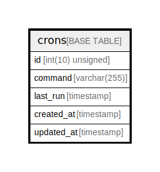

# crons

## Description

<details>
<summary><strong>Table Definition</strong></summary>

```sql
CREATE TABLE `crons` (
  `id` int(10) unsigned NOT NULL AUTO_INCREMENT,
  `command` varchar(255) COLLATE utf8mb4_unicode_ci NOT NULL,
  `last_run` timestamp NOT NULL DEFAULT CURRENT_TIMESTAMP ON UPDATE CURRENT_TIMESTAMP,
  `created_at` timestamp NULL DEFAULT NULL,
  `updated_at` timestamp NULL DEFAULT NULL,
  PRIMARY KEY (`id`),
  UNIQUE KEY `crons_command_unique` (`command`)
) ENGINE=InnoDB DEFAULT CHARSET=utf8mb4 COLLATE=utf8mb4_unicode_ci
```

</details>

## Columns

| Name | Type | Default | Nullable | Extra Definition | Children | Parents | Comment |
| ---- | ---- | ------- | -------- | --------------- | -------- | ------- | ------- |
| id | int(10) unsigned |  | false | auto_increment |  |  |  |
| command | varchar(255) |  | false |  |  |  |  |
| last_run | timestamp | CURRENT_TIMESTAMP | false | on update CURRENT_TIMESTAMP |  |  |  |
| created_at | timestamp |  | true |  |  |  |  |
| updated_at | timestamp |  | true |  |  |  |  |

## Constraints

| Name | Type | Definition |
| ---- | ---- | ---------- |
| crons_command_unique | UNIQUE | UNIQUE KEY crons_command_unique (command) |
| PRIMARY | PRIMARY KEY | PRIMARY KEY (id) |

## Indexes

| Name | Definition |
| ---- | ---------- |
| PRIMARY | PRIMARY KEY (id) USING BTREE |
| crons_command_unique | UNIQUE KEY crons_command_unique (command) USING BTREE |

## Relations



---

> Generated by [tbls](https://github.com/k1LoW/tbls)
