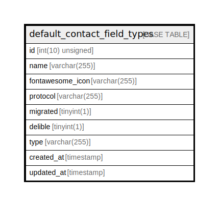

# default_contact_field_types

## Description

<details>
<summary><strong>Table Definition</strong></summary>

```sql
CREATE TABLE `default_contact_field_types` (
  `id` int(10) unsigned NOT NULL AUTO_INCREMENT,
  `name` varchar(255) COLLATE utf8mb4_unicode_ci NOT NULL,
  `fontawesome_icon` varchar(255) COLLATE utf8mb4_unicode_ci DEFAULT NULL,
  `protocol` varchar(255) COLLATE utf8mb4_unicode_ci DEFAULT NULL,
  `migrated` tinyint(1) NOT NULL DEFAULT '0',
  `delible` tinyint(1) NOT NULL DEFAULT '1',
  `type` varchar(255) COLLATE utf8mb4_unicode_ci DEFAULT NULL,
  `created_at` timestamp NULL DEFAULT NULL,
  `updated_at` timestamp NULL DEFAULT NULL,
  PRIMARY KEY (`id`)
) ENGINE=InnoDB AUTO_INCREMENT=[Redacted by tbls] DEFAULT CHARSET=utf8mb4 COLLATE=utf8mb4_unicode_ci
```

</details>

## Columns

| Name | Type | Default | Nullable | Extra Definition | Children | Parents | Comment |
| ---- | ---- | ------- | -------- | --------------- | -------- | ------- | ------- |
| id | int(10) unsigned |  | false | auto_increment |  |  |  |
| name | varchar(255) |  | false |  |  |  |  |
| fontawesome_icon | varchar(255) |  | true |  |  |  |  |
| protocol | varchar(255) |  | true |  |  |  |  |
| migrated | tinyint(1) | 0 | false |  |  |  |  |
| delible | tinyint(1) | 1 | false |  |  |  |  |
| type | varchar(255) |  | true |  |  |  |  |
| created_at | timestamp |  | true |  |  |  |  |
| updated_at | timestamp |  | true |  |  |  |  |

## Constraints

| Name | Type | Definition |
| ---- | ---- | ---------- |
| PRIMARY | PRIMARY KEY | PRIMARY KEY (id) |

## Indexes

| Name | Definition |
| ---- | ---------- |
| PRIMARY | PRIMARY KEY (id) USING BTREE |

## Relations



---

> Generated by [tbls](https://github.com/k1LoW/tbls)
