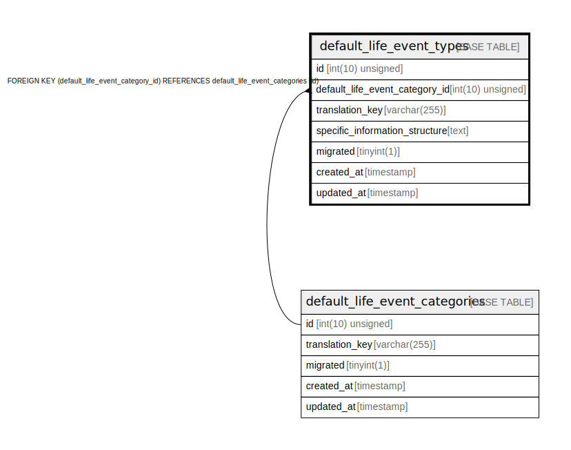

# default_life_event_types

## Description

<details>
<summary><strong>Table Definition</strong></summary>

```sql
CREATE TABLE `default_life_event_types` (
  `id` int(10) unsigned NOT NULL AUTO_INCREMENT,
  `default_life_event_category_id` int(10) unsigned NOT NULL,
  `translation_key` varchar(255) COLLATE utf8mb4_unicode_ci NOT NULL,
  `specific_information_structure` text COLLATE utf8mb4_unicode_ci,
  `migrated` tinyint(1) NOT NULL DEFAULT '0',
  `created_at` timestamp NULL DEFAULT NULL,
  `updated_at` timestamp NULL DEFAULT NULL,
  PRIMARY KEY (`id`),
  KEY `default_life_event_types_default_life_event_category_id_foreign` (`default_life_event_category_id`),
  CONSTRAINT `default_life_event_types_default_life_event_category_id_foreign` FOREIGN KEY (`default_life_event_category_id`) REFERENCES `default_life_event_categories` (`id`) ON DELETE CASCADE
) ENGINE=InnoDB AUTO_INCREMENT=[Redacted by tbls] DEFAULT CHARSET=utf8mb4 COLLATE=utf8mb4_unicode_ci
```

</details>

## Columns

| Name | Type | Default | Nullable | Extra Definition | Children | Parents | Comment |
| ---- | ---- | ------- | -------- | --------------- | -------- | ------- | ------- |
| id | int(10) unsigned |  | false | auto_increment |  |  |  |
| default_life_event_category_id | int(10) unsigned |  | false |  |  | [default_life_event_categories](default_life_event_categories.md) |  |
| translation_key | varchar(255) |  | false |  |  |  |  |
| specific_information_structure | text |  | true |  |  |  |  |
| migrated | tinyint(1) | 0 | false |  |  |  |  |
| created_at | timestamp |  | true |  |  |  |  |
| updated_at | timestamp |  | true |  |  |  |  |

## Constraints

| Name | Type | Definition |
| ---- | ---- | ---------- |
| default_life_event_types_default_life_event_category_id_foreign | FOREIGN KEY | FOREIGN KEY (default_life_event_category_id) REFERENCES default_life_event_categories (id) |
| PRIMARY | PRIMARY KEY | PRIMARY KEY (id) |

## Indexes

| Name | Definition |
| ---- | ---------- |
| default_life_event_types_default_life_event_category_id_foreign | KEY default_life_event_types_default_life_event_category_id_foreign (default_life_event_category_id) USING BTREE |
| PRIMARY | PRIMARY KEY (id) USING BTREE |

## Relations



---

> Generated by [tbls](https://github.com/k1LoW/tbls)
