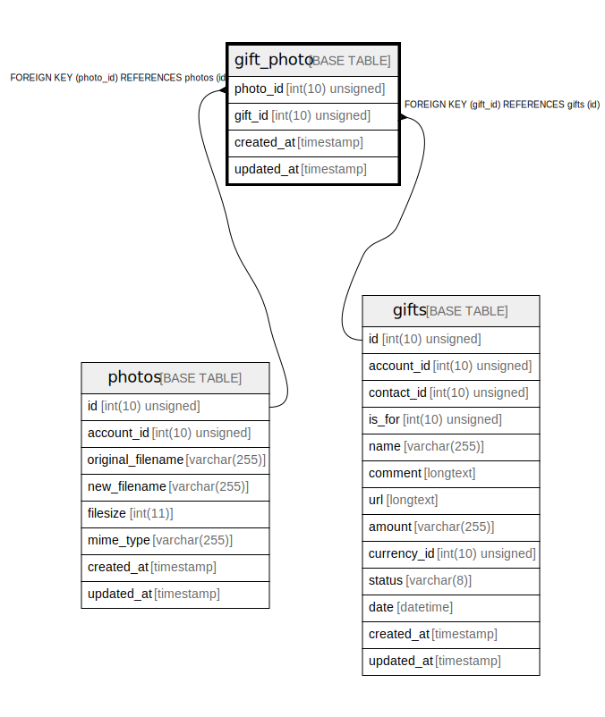

# gift_photo

## Description

<details>
<summary><strong>Table Definition</strong></summary>

```sql
CREATE TABLE `gift_photo` (
  `photo_id` int(10) unsigned NOT NULL,
  `gift_id` int(10) unsigned NOT NULL,
  `created_at` timestamp NULL DEFAULT NULL,
  `updated_at` timestamp NULL DEFAULT NULL,
  PRIMARY KEY (`photo_id`,`gift_id`),
  KEY `gift_photo_gift_id_foreign` (`gift_id`),
  CONSTRAINT `gift_photo_gift_id_foreign` FOREIGN KEY (`gift_id`) REFERENCES `gifts` (`id`) ON DELETE CASCADE,
  CONSTRAINT `gift_photo_photo_id_foreign` FOREIGN KEY (`photo_id`) REFERENCES `photos` (`id`) ON DELETE CASCADE
) ENGINE=InnoDB DEFAULT CHARSET=utf8mb4 COLLATE=utf8mb4_unicode_ci
```

</details>

## Columns

| Name | Type | Default | Nullable | Children | Parents | Comment |
| ---- | ---- | ------- | -------- | -------- | ------- | ------- |
| photo_id | int(10) unsigned |  | false |  | [photos](photos.md) |  |
| gift_id | int(10) unsigned |  | false |  | [gifts](gifts.md) |  |
| created_at | timestamp |  | true |  |  |  |
| updated_at | timestamp |  | true |  |  |  |

## Constraints

| Name | Type | Definition |
| ---- | ---- | ---------- |
| gift_photo_gift_id_foreign | FOREIGN KEY | FOREIGN KEY (gift_id) REFERENCES gifts (id) |
| gift_photo_photo_id_foreign | FOREIGN KEY | FOREIGN KEY (photo_id) REFERENCES photos (id) |
| PRIMARY | PRIMARY KEY | PRIMARY KEY (photo_id, gift_id) |

## Indexes

| Name | Definition |
| ---- | ---------- |
| gift_photo_gift_id_foreign | KEY gift_photo_gift_id_foreign (gift_id) USING BTREE |
| PRIMARY | PRIMARY KEY (photo_id, gift_id) USING BTREE |

## Relations



---

> Generated by [tbls](https://github.com/k1LoW/tbls)
