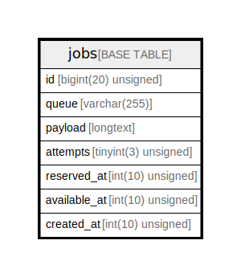

# jobs

## Description

<details>
<summary><strong>Table Definition</strong></summary>

```sql
CREATE TABLE `jobs` (
  `id` bigint(20) unsigned NOT NULL AUTO_INCREMENT,
  `queue` varchar(255) COLLATE utf8mb4_unicode_ci NOT NULL,
  `payload` longtext COLLATE utf8mb4_unicode_ci NOT NULL,
  `attempts` tinyint(3) unsigned NOT NULL,
  `reserved_at` int(10) unsigned DEFAULT NULL,
  `available_at` int(10) unsigned NOT NULL,
  `created_at` int(10) unsigned NOT NULL,
  PRIMARY KEY (`id`),
  KEY `jobs_queue_reserved_at_index` (`queue`,`reserved_at`)
) ENGINE=InnoDB DEFAULT CHARSET=utf8mb4 COLLATE=utf8mb4_unicode_ci
```

</details>

## Columns

| Name | Type | Default | Nullable | Extra Definition | Children | Parents | Comment |
| ---- | ---- | ------- | -------- | --------------- | -------- | ------- | ------- |
| id | bigint(20) unsigned |  | false | auto_increment |  |  |  |
| queue | varchar(255) |  | false |  |  |  |  |
| payload | longtext |  | false |  |  |  |  |
| attempts | tinyint(3) unsigned |  | false |  |  |  |  |
| reserved_at | int(10) unsigned |  | true |  |  |  |  |
| available_at | int(10) unsigned |  | false |  |  |  |  |
| created_at | int(10) unsigned |  | false |  |  |  |  |

## Constraints

| Name | Type | Definition |
| ---- | ---- | ---------- |
| PRIMARY | PRIMARY KEY | PRIMARY KEY (id) |

## Indexes

| Name | Definition |
| ---- | ---------- |
| jobs_queue_reserved_at_index | KEY jobs_queue_reserved_at_index (queue, reserved_at) USING BTREE |
| PRIMARY | PRIMARY KEY (id) USING BTREE |

## Relations



---

> Generated by [tbls](https://github.com/k1LoW/tbls)
