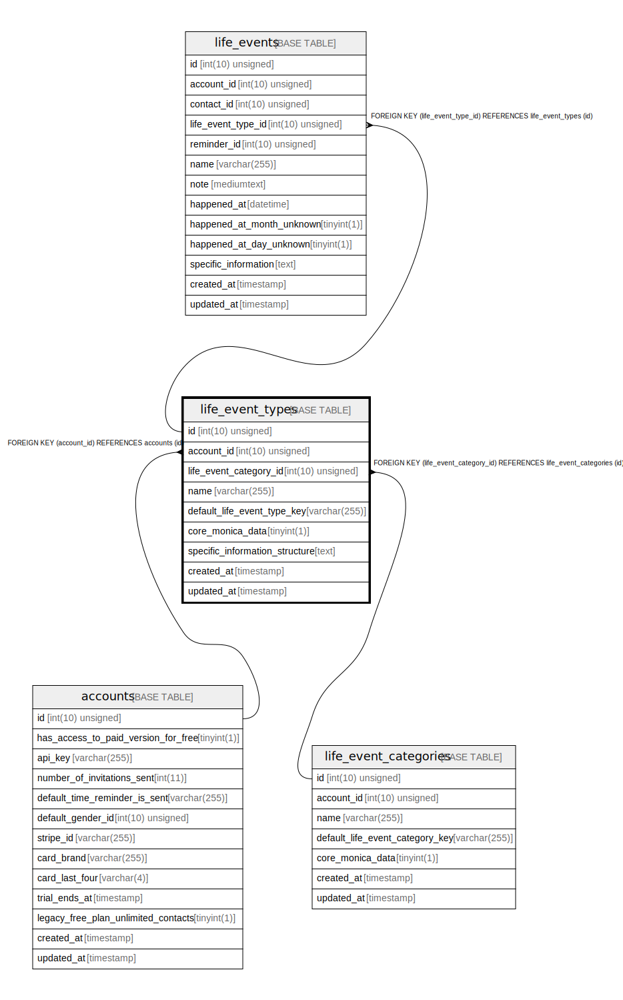

# life_event_types

## Description

<details>
<summary><strong>Table Definition</strong></summary>

```sql
CREATE TABLE `life_event_types` (
  `id` int(10) unsigned NOT NULL AUTO_INCREMENT,
  `account_id` int(10) unsigned NOT NULL,
  `life_event_category_id` int(10) unsigned NOT NULL,
  `name` varchar(255) COLLATE utf8mb4_unicode_ci DEFAULT NULL,
  `default_life_event_type_key` varchar(255) COLLATE utf8mb4_unicode_ci DEFAULT NULL,
  `core_monica_data` tinyint(1) NOT NULL DEFAULT '0',
  `specific_information_structure` text COLLATE utf8mb4_unicode_ci,
  `created_at` timestamp NULL DEFAULT NULL,
  `updated_at` timestamp NULL DEFAULT NULL,
  PRIMARY KEY (`id`),
  KEY `life_event_types_account_id_foreign` (`account_id`),
  KEY `life_event_types_life_event_category_id_foreign` (`life_event_category_id`),
  CONSTRAINT `life_event_types_account_id_foreign` FOREIGN KEY (`account_id`) REFERENCES `accounts` (`id`) ON DELETE CASCADE,
  CONSTRAINT `life_event_types_life_event_category_id_foreign` FOREIGN KEY (`life_event_category_id`) REFERENCES `life_event_categories` (`id`) ON DELETE CASCADE
) ENGINE=InnoDB DEFAULT CHARSET=utf8mb4 COLLATE=utf8mb4_unicode_ci
```

</details>

## Columns

| Name | Type | Default | Nullable | Extra Definition | Children | Parents | Comment |
| ---- | ---- | ------- | -------- | --------------- | -------- | ------- | ------- |
| id | int(10) unsigned |  | false | auto_increment | [life_events](life_events.md) |  |  |
| account_id | int(10) unsigned |  | false |  |  | [accounts](accounts.md) |  |
| life_event_category_id | int(10) unsigned |  | false |  |  | [life_event_categories](life_event_categories.md) |  |
| name | varchar(255) |  | true |  |  |  |  |
| default_life_event_type_key | varchar(255) |  | true |  |  |  |  |
| core_monica_data | tinyint(1) | 0 | false |  |  |  |  |
| specific_information_structure | text |  | true |  |  |  |  |
| created_at | timestamp |  | true |  |  |  |  |
| updated_at | timestamp |  | true |  |  |  |  |

## Constraints

| Name | Type | Definition |
| ---- | ---- | ---------- |
| life_event_types_account_id_foreign | FOREIGN KEY | FOREIGN KEY (account_id) REFERENCES accounts (id) |
| life_event_types_life_event_category_id_foreign | FOREIGN KEY | FOREIGN KEY (life_event_category_id) REFERENCES life_event_categories (id) |
| PRIMARY | PRIMARY KEY | PRIMARY KEY (id) |

## Indexes

| Name | Definition |
| ---- | ---------- |
| life_event_types_account_id_foreign | KEY life_event_types_account_id_foreign (account_id) USING BTREE |
| life_event_types_life_event_category_id_foreign | KEY life_event_types_life_event_category_id_foreign (life_event_category_id) USING BTREE |
| PRIMARY | PRIMARY KEY (id) USING BTREE |

## Relations



---

> Generated by [tbls](https://github.com/k1LoW/tbls)
