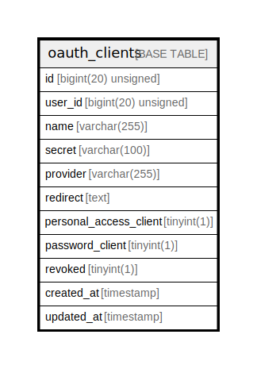

# oauth_clients

## Description

<details>
<summary><strong>Table Definition</strong></summary>

```sql
CREATE TABLE `oauth_clients` (
  `id` bigint(20) unsigned NOT NULL AUTO_INCREMENT,
  `user_id` bigint(20) unsigned DEFAULT NULL,
  `name` varchar(255) COLLATE utf8mb4_unicode_ci NOT NULL,
  `secret` varchar(100) COLLATE utf8mb4_unicode_ci DEFAULT NULL,
  `provider` varchar(255) COLLATE utf8mb4_unicode_ci DEFAULT NULL,
  `redirect` text COLLATE utf8mb4_unicode_ci NOT NULL,
  `personal_access_client` tinyint(1) NOT NULL,
  `password_client` tinyint(1) NOT NULL,
  `revoked` tinyint(1) NOT NULL,
  `created_at` timestamp NULL DEFAULT NULL,
  `updated_at` timestamp NULL DEFAULT NULL,
  PRIMARY KEY (`id`),
  KEY `oauth_clients_user_id_index` (`user_id`)
) ENGINE=InnoDB AUTO_INCREMENT=[Redacted by tbls] DEFAULT CHARSET=utf8mb4 COLLATE=utf8mb4_unicode_ci
```

</details>

## Columns

| Name | Type | Default | Nullable | Extra Definition | Children | Parents | Comment |
| ---- | ---- | ------- | -------- | --------------- | -------- | ------- | ------- |
| id | bigint(20) unsigned |  | false | auto_increment |  |  |  |
| user_id | bigint(20) unsigned |  | true |  |  |  |  |
| name | varchar(255) |  | false |  |  |  |  |
| secret | varchar(100) |  | true |  |  |  |  |
| provider | varchar(255) |  | true |  |  |  |  |
| redirect | text |  | false |  |  |  |  |
| personal_access_client | tinyint(1) |  | false |  |  |  |  |
| password_client | tinyint(1) |  | false |  |  |  |  |
| revoked | tinyint(1) |  | false |  |  |  |  |
| created_at | timestamp |  | true |  |  |  |  |
| updated_at | timestamp |  | true |  |  |  |  |

## Constraints

| Name | Type | Definition |
| ---- | ---- | ---------- |
| PRIMARY | PRIMARY KEY | PRIMARY KEY (id) |

## Indexes

| Name | Definition |
| ---- | ---------- |
| oauth_clients_user_id_index | KEY oauth_clients_user_id_index (user_id) USING BTREE |
| PRIMARY | PRIMARY KEY (id) USING BTREE |

## Relations



---

> Generated by [tbls](https://github.com/k1LoW/tbls)
