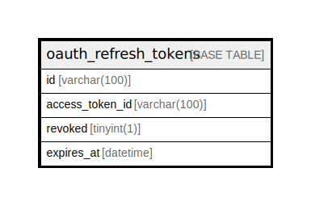

# oauth_refresh_tokens

## Description

<details>
<summary><strong>Table Definition</strong></summary>

```sql
CREATE TABLE `oauth_refresh_tokens` (
  `id` varchar(100) COLLATE utf8mb4_unicode_ci NOT NULL,
  `access_token_id` varchar(100) COLLATE utf8mb4_unicode_ci NOT NULL,
  `revoked` tinyint(1) NOT NULL,
  `expires_at` datetime DEFAULT NULL,
  PRIMARY KEY (`id`),
  KEY `oauth_refresh_tokens_access_token_id_index` (`access_token_id`)
) ENGINE=InnoDB DEFAULT CHARSET=utf8mb4 COLLATE=utf8mb4_unicode_ci
```

</details>

## Columns

| Name | Type | Default | Nullable | Children | Parents | Comment |
| ---- | ---- | ------- | -------- | -------- | ------- | ------- |
| id | varchar(100) |  | false |  |  |  |
| access_token_id | varchar(100) |  | false |  |  |  |
| revoked | tinyint(1) |  | false |  |  |  |
| expires_at | datetime |  | true |  |  |  |

## Constraints

| Name | Type | Definition |
| ---- | ---- | ---------- |
| PRIMARY | PRIMARY KEY | PRIMARY KEY (id) |

## Indexes

| Name | Definition |
| ---- | ---------- |
| oauth_refresh_tokens_access_token_id_index | KEY oauth_refresh_tokens_access_token_id_index (access_token_id) USING BTREE |
| PRIMARY | PRIMARY KEY (id) USING BTREE |

## Relations



---

> Generated by [tbls](https://github.com/k1LoW/tbls)
