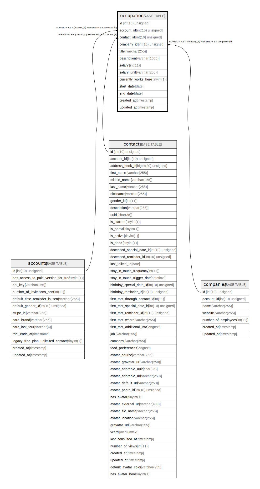

# occupations

## Description

<details>
<summary><strong>Table Definition</strong></summary>

```sql
CREATE TABLE `occupations` (
  `id` int(10) unsigned NOT NULL AUTO_INCREMENT,
  `account_id` int(10) unsigned NOT NULL,
  `contact_id` int(10) unsigned NOT NULL,
  `company_id` int(10) unsigned NOT NULL,
  `title` varchar(255) COLLATE utf8mb4_unicode_ci NOT NULL,
  `description` varchar(1000) COLLATE utf8mb4_unicode_ci DEFAULT NULL,
  `salary` int(11) DEFAULT NULL,
  `salary_unit` varchar(255) COLLATE utf8mb4_unicode_ci DEFAULT NULL,
  `currently_works_here` tinyint(1) DEFAULT '0',
  `start_date` date DEFAULT NULL,
  `end_date` date DEFAULT NULL,
  `created_at` timestamp NULL DEFAULT NULL,
  `updated_at` timestamp NULL DEFAULT NULL,
  PRIMARY KEY (`id`),
  KEY `occupations_account_id_foreign` (`account_id`),
  KEY `occupations_contact_id_foreign` (`contact_id`),
  KEY `occupations_company_id_foreign` (`company_id`),
  CONSTRAINT `occupations_account_id_foreign` FOREIGN KEY (`account_id`) REFERENCES `accounts` (`id`) ON DELETE CASCADE,
  CONSTRAINT `occupations_company_id_foreign` FOREIGN KEY (`company_id`) REFERENCES `companies` (`id`) ON DELETE CASCADE,
  CONSTRAINT `occupations_contact_id_foreign` FOREIGN KEY (`contact_id`) REFERENCES `contacts` (`id`) ON DELETE CASCADE
) ENGINE=InnoDB DEFAULT CHARSET=utf8mb4 COLLATE=utf8mb4_unicode_ci
```

</details>

## Columns

| Name | Type | Default | Nullable | Extra Definition | Children | Parents | Comment |
| ---- | ---- | ------- | -------- | --------------- | -------- | ------- | ------- |
| id | int(10) unsigned |  | false | auto_increment |  |  |  |
| account_id | int(10) unsigned |  | false |  |  | [accounts](accounts.md) |  |
| contact_id | int(10) unsigned |  | false |  |  | [contacts](contacts.md) |  |
| company_id | int(10) unsigned |  | false |  |  | [companies](companies.md) |  |
| title | varchar(255) |  | false |  |  |  |  |
| description | varchar(1000) |  | true |  |  |  |  |
| salary | int(11) |  | true |  |  |  |  |
| salary_unit | varchar(255) |  | true |  |  |  |  |
| currently_works_here | tinyint(1) | 0 | true |  |  |  |  |
| start_date | date |  | true |  |  |  |  |
| end_date | date |  | true |  |  |  |  |
| created_at | timestamp |  | true |  |  |  |  |
| updated_at | timestamp |  | true |  |  |  |  |

## Constraints

| Name | Type | Definition |
| ---- | ---- | ---------- |
| occupations_account_id_foreign | FOREIGN KEY | FOREIGN KEY (account_id) REFERENCES accounts (id) |
| occupations_company_id_foreign | FOREIGN KEY | FOREIGN KEY (company_id) REFERENCES companies (id) |
| occupations_contact_id_foreign | FOREIGN KEY | FOREIGN KEY (contact_id) REFERENCES contacts (id) |
| PRIMARY | PRIMARY KEY | PRIMARY KEY (id) |

## Indexes

| Name | Definition |
| ---- | ---------- |
| occupations_account_id_foreign | KEY occupations_account_id_foreign (account_id) USING BTREE |
| occupations_company_id_foreign | KEY occupations_company_id_foreign (company_id) USING BTREE |
| occupations_contact_id_foreign | KEY occupations_contact_id_foreign (contact_id) USING BTREE |
| PRIMARY | PRIMARY KEY (id) USING BTREE |

## Relations



---

> Generated by [tbls](https://github.com/k1LoW/tbls)
