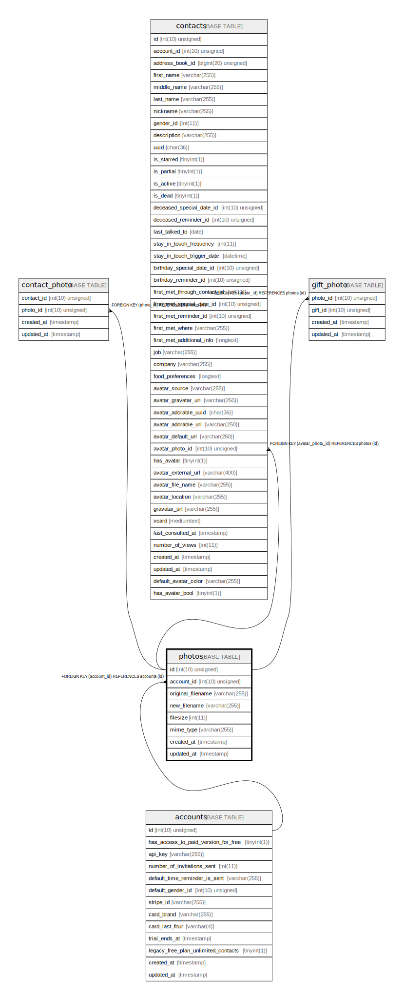

# photos

## Description

<details>
<summary><strong>Table Definition</strong></summary>

```sql
CREATE TABLE `photos` (
  `id` int(10) unsigned NOT NULL AUTO_INCREMENT,
  `account_id` int(10) unsigned NOT NULL,
  `original_filename` varchar(255) COLLATE utf8mb4_unicode_ci NOT NULL,
  `new_filename` varchar(255) COLLATE utf8mb4_unicode_ci NOT NULL,
  `filesize` int(11) DEFAULT NULL,
  `mime_type` varchar(255) COLLATE utf8mb4_unicode_ci DEFAULT NULL,
  `created_at` timestamp NULL DEFAULT NULL,
  `updated_at` timestamp NULL DEFAULT NULL,
  PRIMARY KEY (`id`),
  KEY `photos_account_id_foreign` (`account_id`),
  CONSTRAINT `photos_account_id_foreign` FOREIGN KEY (`account_id`) REFERENCES `accounts` (`id`) ON DELETE CASCADE
) ENGINE=InnoDB DEFAULT CHARSET=utf8mb4 COLLATE=utf8mb4_unicode_ci
```

</details>

## Columns

| Name | Type | Default | Nullable | Extra Definition | Children | Parents | Comment |
| ---- | ---- | ------- | -------- | --------------- | -------- | ------- | ------- |
| id | int(10) unsigned |  | false | auto_increment | [contact_photo](contact_photo.md) [contacts](contacts.md) [gift_photo](gift_photo.md) |  |  |
| account_id | int(10) unsigned |  | false |  |  | [accounts](accounts.md) |  |
| original_filename | varchar(255) |  | false |  |  |  |  |
| new_filename | varchar(255) |  | false |  |  |  |  |
| filesize | int(11) |  | true |  |  |  |  |
| mime_type | varchar(255) |  | true |  |  |  |  |
| created_at | timestamp |  | true |  |  |  |  |
| updated_at | timestamp |  | true |  |  |  |  |

## Constraints

| Name | Type | Definition |
| ---- | ---- | ---------- |
| photos_account_id_foreign | FOREIGN KEY | FOREIGN KEY (account_id) REFERENCES accounts (id) |
| PRIMARY | PRIMARY KEY | PRIMARY KEY (id) |

## Indexes

| Name | Definition |
| ---- | ---------- |
| photos_account_id_foreign | KEY photos_account_id_foreign (account_id) USING BTREE |
| PRIMARY | PRIMARY KEY (id) USING BTREE |

## Relations



---

> Generated by [tbls](https://github.com/k1LoW/tbls)
