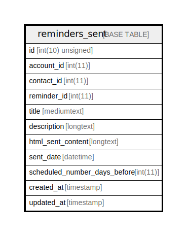

# reminders_sent

## Description

<details>
<summary><strong>Table Definition</strong></summary>

```sql
CREATE TABLE `reminders_sent` (
  `id` int(10) unsigned NOT NULL AUTO_INCREMENT,
  `account_id` int(11) NOT NULL,
  `contact_id` int(11) NOT NULL,
  `reminder_id` int(11) DEFAULT NULL,
  `title` mediumtext COLLATE utf8mb4_unicode_ci NOT NULL,
  `description` longtext COLLATE utf8mb4_unicode_ci NOT NULL,
  `html_sent_content` longtext COLLATE utf8mb4_unicode_ci NOT NULL,
  `sent_date` datetime NOT NULL,
  `scheduled_number_days_before` int(11) DEFAULT NULL,
  `created_at` timestamp NULL DEFAULT NULL,
  `updated_at` timestamp NULL DEFAULT NULL,
  PRIMARY KEY (`id`)
) ENGINE=InnoDB DEFAULT CHARSET=utf8mb4 COLLATE=utf8mb4_unicode_ci
```

</details>

## Columns

| Name | Type | Default | Nullable | Extra Definition | Children | Parents | Comment |
| ---- | ---- | ------- | -------- | --------------- | -------- | ------- | ------- |
| id | int(10) unsigned |  | false | auto_increment |  |  |  |
| account_id | int(11) |  | false |  |  |  |  |
| contact_id | int(11) |  | false |  |  |  |  |
| reminder_id | int(11) |  | true |  |  |  |  |
| title | mediumtext |  | false |  |  |  |  |
| description | longtext |  | false |  |  |  |  |
| html_sent_content | longtext |  | false |  |  |  |  |
| sent_date | datetime |  | false |  |  |  |  |
| scheduled_number_days_before | int(11) |  | true |  |  |  |  |
| created_at | timestamp |  | true |  |  |  |  |
| updated_at | timestamp |  | true |  |  |  |  |

## Constraints

| Name | Type | Definition |
| ---- | ---- | ---------- |
| PRIMARY | PRIMARY KEY | PRIMARY KEY (id) |

## Indexes

| Name | Definition |
| ---- | ---------- |
| PRIMARY | PRIMARY KEY (id) USING BTREE |

## Relations



---

> Generated by [tbls](https://github.com/k1LoW/tbls)
