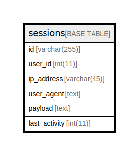

# sessions

## Description

<details>
<summary><strong>Table Definition</strong></summary>

```sql
CREATE TABLE `sessions` (
  `id` varchar(255) COLLATE utf8mb4_unicode_ci NOT NULL,
  `user_id` int(11) DEFAULT NULL,
  `ip_address` varchar(45) COLLATE utf8mb4_unicode_ci DEFAULT NULL,
  `user_agent` text COLLATE utf8mb4_unicode_ci,
  `payload` text COLLATE utf8mb4_unicode_ci NOT NULL,
  `last_activity` int(11) NOT NULL,
  UNIQUE KEY `sessions_id_unique` (`id`)
) ENGINE=InnoDB DEFAULT CHARSET=utf8mb4 COLLATE=utf8mb4_unicode_ci
```

</details>

## Columns

| Name | Type | Default | Nullable | Children | Parents | Comment |
| ---- | ---- | ------- | -------- | -------- | ------- | ------- |
| id | varchar(255) |  | false |  |  |  |
| user_id | int(11) |  | true |  |  |  |
| ip_address | varchar(45) |  | true |  |  |  |
| user_agent | text |  | true |  |  |  |
| payload | text |  | false |  |  |  |
| last_activity | int(11) |  | false |  |  |  |

## Constraints

| Name | Type | Definition |
| ---- | ---- | ---------- |
| sessions_id_unique | UNIQUE | UNIQUE KEY sessions_id_unique (id) |

## Indexes

| Name | Definition |
| ---- | ---------- |
| sessions_id_unique | UNIQUE KEY sessions_id_unique (id) USING BTREE |

## Relations



---

> Generated by [tbls](https://github.com/k1LoW/tbls)
