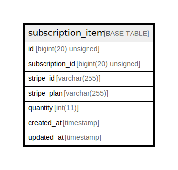

# subscription_items

## Description

<details>
<summary><strong>Table Definition</strong></summary>

```sql
CREATE TABLE `subscription_items` (
  `id` bigint(20) unsigned NOT NULL AUTO_INCREMENT,
  `subscription_id` bigint(20) unsigned NOT NULL,
  `stripe_id` varchar(255) COLLATE utf8mb4_unicode_ci NOT NULL,
  `stripe_plan` varchar(255) COLLATE utf8mb4_unicode_ci NOT NULL,
  `quantity` int(11) NOT NULL,
  `created_at` timestamp NULL DEFAULT NULL,
  `updated_at` timestamp NULL DEFAULT NULL,
  PRIMARY KEY (`id`),
  UNIQUE KEY `subscription_items_subscription_id_stripe_plan_unique` (`subscription_id`,`stripe_plan`),
  KEY `subscription_items_stripe_id_index` (`stripe_id`)
) ENGINE=InnoDB DEFAULT CHARSET=utf8mb4 COLLATE=utf8mb4_unicode_ci
```

</details>

## Columns

| Name | Type | Default | Nullable | Extra Definition | Children | Parents | Comment |
| ---- | ---- | ------- | -------- | --------------- | -------- | ------- | ------- |
| id | bigint(20) unsigned |  | false | auto_increment |  |  |  |
| subscription_id | bigint(20) unsigned |  | false |  |  |  |  |
| stripe_id | varchar(255) |  | false |  |  |  |  |
| stripe_plan | varchar(255) |  | false |  |  |  |  |
| quantity | int(11) |  | false |  |  |  |  |
| created_at | timestamp |  | true |  |  |  |  |
| updated_at | timestamp |  | true |  |  |  |  |

## Constraints

| Name | Type | Definition |
| ---- | ---- | ---------- |
| PRIMARY | PRIMARY KEY | PRIMARY KEY (id) |
| subscription_items_subscription_id_stripe_plan_unique | UNIQUE | UNIQUE KEY subscription_items_subscription_id_stripe_plan_unique (subscription_id, stripe_plan) |

## Indexes

| Name | Definition |
| ---- | ---------- |
| subscription_items_stripe_id_index | KEY subscription_items_stripe_id_index (stripe_id) USING BTREE |
| PRIMARY | PRIMARY KEY (id) USING BTREE |
| subscription_items_subscription_id_stripe_plan_unique | UNIQUE KEY subscription_items_subscription_id_stripe_plan_unique (subscription_id, stripe_plan) USING BTREE |

## Relations



---

> Generated by [tbls](https://github.com/k1LoW/tbls)
