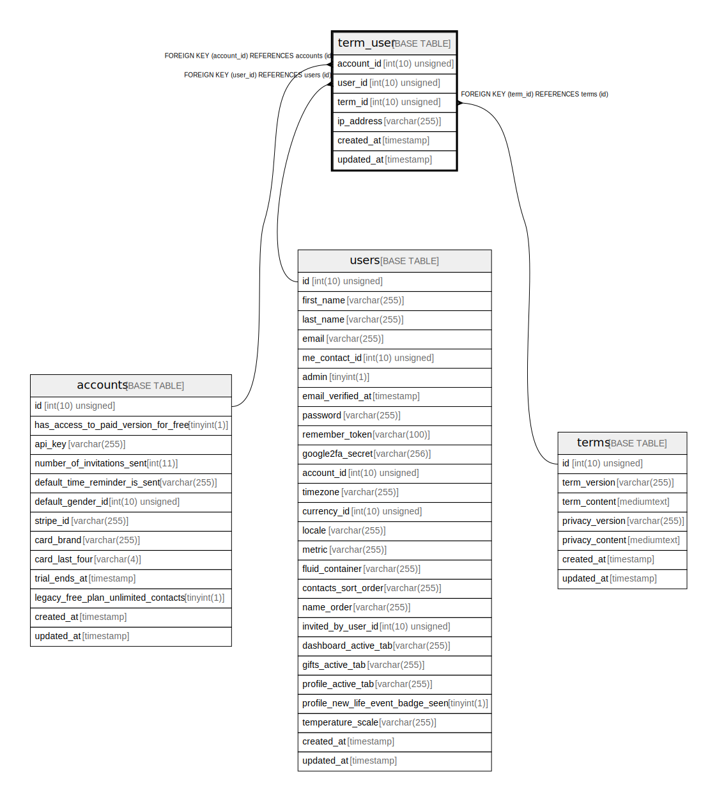

# term_user

## Description

<details>
<summary><strong>Table Definition</strong></summary>

```sql
CREATE TABLE `term_user` (
  `account_id` int(10) unsigned NOT NULL,
  `user_id` int(10) unsigned NOT NULL,
  `term_id` int(10) unsigned NOT NULL,
  `ip_address` varchar(255) COLLATE utf8mb4_unicode_ci DEFAULT NULL,
  `created_at` timestamp NULL DEFAULT NULL,
  `updated_at` timestamp NULL DEFAULT NULL,
  KEY `term_user_account_id_foreign` (`account_id`),
  KEY `term_user_user_id_foreign` (`user_id`),
  KEY `term_user_term_id_foreign` (`term_id`),
  CONSTRAINT `term_user_account_id_foreign` FOREIGN KEY (`account_id`) REFERENCES `accounts` (`id`) ON DELETE CASCADE,
  CONSTRAINT `term_user_term_id_foreign` FOREIGN KEY (`term_id`) REFERENCES `terms` (`id`) ON DELETE CASCADE,
  CONSTRAINT `term_user_user_id_foreign` FOREIGN KEY (`user_id`) REFERENCES `users` (`id`) ON DELETE CASCADE
) ENGINE=InnoDB DEFAULT CHARSET=utf8mb4 COLLATE=utf8mb4_unicode_ci
```

</details>

## Columns

| Name | Type | Default | Nullable | Children | Parents | Comment |
| ---- | ---- | ------- | -------- | -------- | ------- | ------- |
| account_id | int(10) unsigned |  | false |  | [accounts](accounts.md) |  |
| user_id | int(10) unsigned |  | false |  | [users](users.md) |  |
| term_id | int(10) unsigned |  | false |  | [terms](terms.md) |  |
| ip_address | varchar(255) |  | true |  |  |  |
| created_at | timestamp |  | true |  |  |  |
| updated_at | timestamp |  | true |  |  |  |

## Constraints

| Name | Type | Definition |
| ---- | ---- | ---------- |
| term_user_account_id_foreign | FOREIGN KEY | FOREIGN KEY (account_id) REFERENCES accounts (id) |
| term_user_term_id_foreign | FOREIGN KEY | FOREIGN KEY (term_id) REFERENCES terms (id) |
| term_user_user_id_foreign | FOREIGN KEY | FOREIGN KEY (user_id) REFERENCES users (id) |

## Indexes

| Name | Definition |
| ---- | ---------- |
| term_user_account_id_foreign | KEY term_user_account_id_foreign (account_id) USING BTREE |
| term_user_term_id_foreign | KEY term_user_term_id_foreign (term_id) USING BTREE |
| term_user_user_id_foreign | KEY term_user_user_id_foreign (user_id) USING BTREE |

## Relations



---

> Generated by [tbls](https://github.com/k1LoW/tbls)
