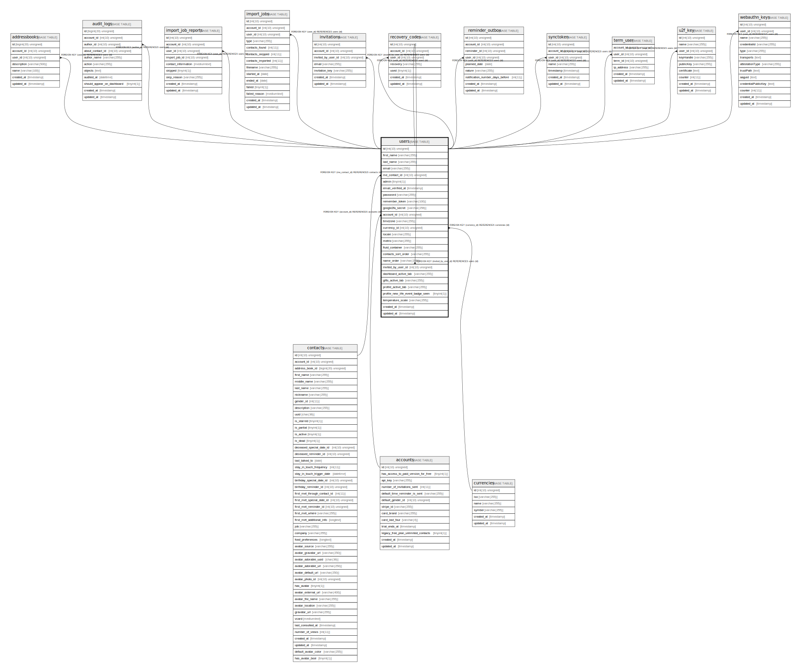

# users

## Description

<details>
<summary><strong>Table Definition</strong></summary>

```sql
CREATE TABLE `users` (
  `id` int(10) unsigned NOT NULL AUTO_INCREMENT,
  `first_name` varchar(255) COLLATE utf8mb4_unicode_ci NOT NULL,
  `last_name` varchar(255) COLLATE utf8mb4_unicode_ci NOT NULL,
  `email` varchar(255) COLLATE utf8mb4_unicode_ci NOT NULL,
  `me_contact_id` int(10) unsigned DEFAULT NULL,
  `admin` tinyint(1) NOT NULL DEFAULT '0',
  `email_verified_at` timestamp NULL DEFAULT NULL,
  `password` varchar(255) COLLATE utf8mb4_unicode_ci NOT NULL,
  `remember_token` varchar(100) COLLATE utf8mb4_unicode_ci DEFAULT NULL,
  `google2fa_secret` varchar(256) COLLATE utf8mb4_unicode_ci DEFAULT NULL,
  `account_id` int(10) unsigned NOT NULL,
  `timezone` varchar(255) COLLATE utf8mb4_unicode_ci DEFAULT NULL,
  `currency_id` int(10) unsigned DEFAULT '2',
  `locale` varchar(255) COLLATE utf8mb4_unicode_ci NOT NULL DEFAULT 'en',
  `metric` varchar(255) COLLATE utf8mb4_unicode_ci NOT NULL DEFAULT 'fahrenheit',
  `fluid_container` varchar(255) COLLATE utf8mb4_unicode_ci NOT NULL DEFAULT 'false',
  `contacts_sort_order` varchar(255) COLLATE utf8mb4_unicode_ci NOT NULL DEFAULT 'firstnameAZ',
  `name_order` varchar(255) COLLATE utf8mb4_unicode_ci NOT NULL DEFAULT 'firstname_lastname_nickname',
  `invited_by_user_id` int(10) unsigned DEFAULT NULL,
  `dashboard_active_tab` varchar(255) COLLATE utf8mb4_unicode_ci NOT NULL DEFAULT 'calls',
  `gifts_active_tab` varchar(255) COLLATE utf8mb4_unicode_ci NOT NULL DEFAULT 'ideas',
  `profile_active_tab` varchar(255) COLLATE utf8mb4_unicode_ci NOT NULL DEFAULT 'notes',
  `profile_new_life_event_badge_seen` tinyint(1) NOT NULL DEFAULT '0',
  `temperature_scale` varchar(255) COLLATE utf8mb4_unicode_ci DEFAULT 'celsius',
  `created_at` timestamp NULL DEFAULT NULL,
  `updated_at` timestamp NULL DEFAULT NULL,
  PRIMARY KEY (`id`),
  UNIQUE KEY `users_email_unique` (`email`),
  KEY `users_me_contact_id_foreign` (`me_contact_id`),
  KEY `users_account_id_foreign` (`account_id`),
  KEY `users_currency_id_foreign` (`currency_id`),
  KEY `users_invited_by_user_id_foreign` (`invited_by_user_id`),
  CONSTRAINT `users_account_id_foreign` FOREIGN KEY (`account_id`) REFERENCES `accounts` (`id`) ON DELETE CASCADE,
  CONSTRAINT `users_currency_id_foreign` FOREIGN KEY (`currency_id`) REFERENCES `currencies` (`id`) ON DELETE SET NULL,
  CONSTRAINT `users_invited_by_user_id_foreign` FOREIGN KEY (`invited_by_user_id`) REFERENCES `users` (`id`) ON DELETE SET NULL,
  CONSTRAINT `users_me_contact_id_foreign` FOREIGN KEY (`me_contact_id`) REFERENCES `contacts` (`id`) ON DELETE SET NULL
) ENGINE=InnoDB DEFAULT CHARSET=utf8mb4 COLLATE=utf8mb4_unicode_ci
```

</details>

## Columns

| Name | Type | Default | Nullable | Extra Definition | Children | Parents | Comment |
| ---- | ---- | ------- | -------- | --------------- | -------- | ------- | ------- |
| id | int(10) unsigned |  | false | auto_increment | [addressbooks](addressbooks.md) [audit_logs](audit_logs.md) [import_job_reports](import_job_reports.md) [import_jobs](import_jobs.md) [invitations](invitations.md) [recovery_codes](recovery_codes.md) [reminder_outbox](reminder_outbox.md) [synctoken](synctoken.md) [term_user](term_user.md) [u2f_key](u2f_key.md) [users](users.md) [webauthn_keys](webauthn_keys.md) |  |  |
| first_name | varchar(255) |  | false |  |  |  |  |
| last_name | varchar(255) |  | false |  |  |  |  |
| email | varchar(255) |  | false |  |  |  |  |
| me_contact_id | int(10) unsigned |  | true |  |  | [contacts](contacts.md) |  |
| admin | tinyint(1) | 0 | false |  |  |  |  |
| email_verified_at | timestamp |  | true |  |  |  |  |
| password | varchar(255) |  | false |  |  |  |  |
| remember_token | varchar(100) |  | true |  |  |  |  |
| google2fa_secret | varchar(256) |  | true |  |  |  |  |
| account_id | int(10) unsigned |  | false |  |  | [accounts](accounts.md) |  |
| timezone | varchar(255) |  | true |  |  |  |  |
| currency_id | int(10) unsigned | 2 | true |  |  | [currencies](currencies.md) |  |
| locale | varchar(255) | en | false |  |  |  |  |
| metric | varchar(255) | fahrenheit | false |  |  |  |  |
| fluid_container | varchar(255) | false | false |  |  |  |  |
| contacts_sort_order | varchar(255) | firstnameAZ | false |  |  |  |  |
| name_order | varchar(255) | firstname_lastname_nickname | false |  |  |  |  |
| invited_by_user_id | int(10) unsigned |  | true |  |  | [users](users.md) |  |
| dashboard_active_tab | varchar(255) | calls | false |  |  |  |  |
| gifts_active_tab | varchar(255) | ideas | false |  |  |  |  |
| profile_active_tab | varchar(255) | notes | false |  |  |  |  |
| profile_new_life_event_badge_seen | tinyint(1) | 0 | false |  |  |  |  |
| temperature_scale | varchar(255) | celsius | true |  |  |  |  |
| created_at | timestamp |  | true |  |  |  |  |
| updated_at | timestamp |  | true |  |  |  |  |

## Constraints

| Name | Type | Definition |
| ---- | ---- | ---------- |
| PRIMARY | PRIMARY KEY | PRIMARY KEY (id) |
| users_account_id_foreign | FOREIGN KEY | FOREIGN KEY (account_id) REFERENCES accounts (id) |
| users_currency_id_foreign | FOREIGN KEY | FOREIGN KEY (currency_id) REFERENCES currencies (id) |
| users_email_unique | UNIQUE | UNIQUE KEY users_email_unique (email) |
| users_invited_by_user_id_foreign | FOREIGN KEY | FOREIGN KEY (invited_by_user_id) REFERENCES users (id) |
| users_me_contact_id_foreign | FOREIGN KEY | FOREIGN KEY (me_contact_id) REFERENCES contacts (id) |

## Indexes

| Name | Definition |
| ---- | ---------- |
| users_account_id_foreign | KEY users_account_id_foreign (account_id) USING BTREE |
| users_currency_id_foreign | KEY users_currency_id_foreign (currency_id) USING BTREE |
| users_invited_by_user_id_foreign | KEY users_invited_by_user_id_foreign (invited_by_user_id) USING BTREE |
| users_me_contact_id_foreign | KEY users_me_contact_id_foreign (me_contact_id) USING BTREE |
| PRIMARY | PRIMARY KEY (id) USING BTREE |
| users_email_unique | UNIQUE KEY users_email_unique (email) USING BTREE |

## Relations



---

> Generated by [tbls](https://github.com/k1LoW/tbls)
