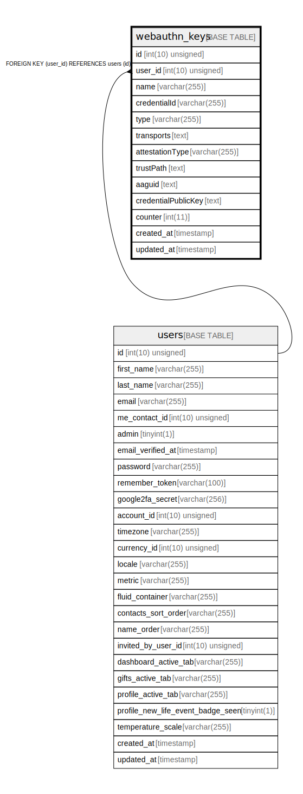

# webauthn_keys

## Description

<details>
<summary><strong>Table Definition</strong></summary>

```sql
CREATE TABLE `webauthn_keys` (
  `id` int(10) unsigned NOT NULL AUTO_INCREMENT,
  `user_id` int(10) unsigned NOT NULL,
  `name` varchar(255) COLLATE utf8mb4_unicode_ci NOT NULL DEFAULT 'key',
  `credentialId` varchar(255) COLLATE utf8mb4_unicode_ci NOT NULL,
  `type` varchar(255) COLLATE utf8mb4_unicode_ci NOT NULL,
  `transports` text COLLATE utf8mb4_unicode_ci NOT NULL,
  `attestationType` varchar(255) COLLATE utf8mb4_unicode_ci NOT NULL,
  `trustPath` text COLLATE utf8mb4_unicode_ci NOT NULL,
  `aaguid` text COLLATE utf8mb4_unicode_ci NOT NULL,
  `credentialPublicKey` text COLLATE utf8mb4_unicode_ci NOT NULL,
  `counter` int(11) NOT NULL,
  `created_at` timestamp NULL DEFAULT NULL,
  `updated_at` timestamp NULL DEFAULT NULL,
  PRIMARY KEY (`id`),
  KEY `webauthn_keys_user_id_foreign` (`user_id`),
  KEY `webauthn_keys_credentialid_index` (`credentialId`),
  CONSTRAINT `webauthn_keys_user_id_foreign` FOREIGN KEY (`user_id`) REFERENCES `users` (`id`) ON DELETE CASCADE
) ENGINE=InnoDB DEFAULT CHARSET=utf8mb4 COLLATE=utf8mb4_unicode_ci
```

</details>

## Columns

| Name | Type | Default | Nullable | Extra Definition | Children | Parents | Comment |
| ---- | ---- | ------- | -------- | --------------- | -------- | ------- | ------- |
| id | int(10) unsigned |  | false | auto_increment |  |  |  |
| user_id | int(10) unsigned |  | false |  |  | [users](users.md) |  |
| name | varchar(255) | key | false |  |  |  |  |
| credentialId | varchar(255) |  | false |  |  |  |  |
| type | varchar(255) |  | false |  |  |  |  |
| transports | text |  | false |  |  |  |  |
| attestationType | varchar(255) |  | false |  |  |  |  |
| trustPath | text |  | false |  |  |  |  |
| aaguid | text |  | false |  |  |  |  |
| credentialPublicKey | text |  | false |  |  |  |  |
| counter | int(11) |  | false |  |  |  |  |
| created_at | timestamp |  | true |  |  |  |  |
| updated_at | timestamp |  | true |  |  |  |  |

## Constraints

| Name | Type | Definition |
| ---- | ---- | ---------- |
| PRIMARY | PRIMARY KEY | PRIMARY KEY (id) |
| webauthn_keys_user_id_foreign | FOREIGN KEY | FOREIGN KEY (user_id) REFERENCES users (id) |

## Indexes

| Name | Definition |
| ---- | ---------- |
| webauthn_keys_credentialid_index | KEY webauthn_keys_credentialid_index (credentialId) USING BTREE |
| webauthn_keys_user_id_foreign | KEY webauthn_keys_user_id_foreign (user_id) USING BTREE |
| PRIMARY | PRIMARY KEY (id) USING BTREE |

## Relations



---

> Generated by [tbls](https://github.com/k1LoW/tbls)
