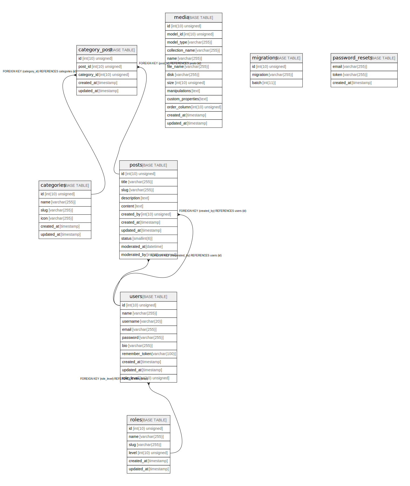

# vuedo

## Tables

| Name | Columns | Comment | Type |
| ---- | ------- | ------- | ---- |
| [categories](categories.md) | 6 |  | BASE TABLE |
| [category_post](category_post.md) | 5 |  | BASE TABLE |
| [media](media.md) | 13 |  | BASE TABLE |
| [migrations](migrations.md) | 3 |  | BASE TABLE |
| [password_resets](password_resets.md) | 3 |  | BASE TABLE |
| [posts](posts.md) | 11 |  | BASE TABLE |
| [roles](roles.md) | 6 |  | BASE TABLE |
| [users](users.md) | 10 |  | BASE TABLE |

## Relations

---

> Generated by [tbls](https://github.com/k1LoW/tbls)
