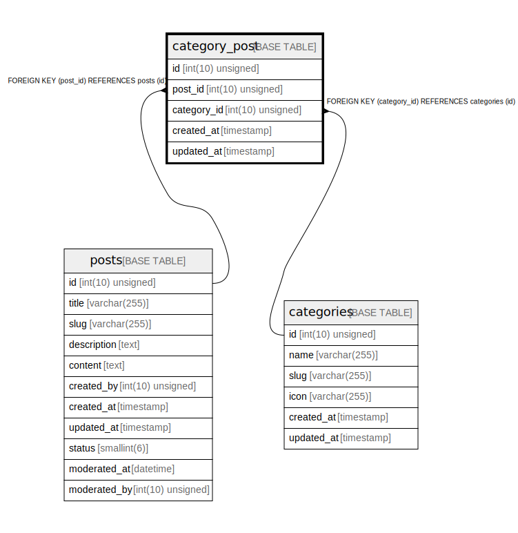

# category_post

## Description

<details>
<summary><strong>Table Definition</strong></summary>

```sql
CREATE TABLE `category_post` (
  `id` int(10) unsigned NOT NULL AUTO_INCREMENT,
  `post_id` int(10) unsigned NOT NULL,
  `category_id` int(10) unsigned DEFAULT NULL,
  `created_at` timestamp NULL DEFAULT NULL,
  `updated_at` timestamp NULL DEFAULT NULL,
  PRIMARY KEY (`id`),
  KEY `category_post_post_id_foreign` (`post_id`),
  KEY `category_post_category_id_foreign` (`category_id`),
  CONSTRAINT `category_post_category_id_foreign` FOREIGN KEY (`category_id`) REFERENCES `categories` (`id`) ON DELETE CASCADE,
  CONSTRAINT `category_post_post_id_foreign` FOREIGN KEY (`post_id`) REFERENCES `posts` (`id`) ON DELETE CASCADE
) ENGINE=InnoDB DEFAULT CHARSET=utf8mb4 COLLATE=utf8mb4_unicode_ci
```

</details>

## Columns

| Name | Type | Default | Nullable | Extra Definition | Children | Parents | Comment |
| ---- | ---- | ------- | -------- | --------------- | -------- | ------- | ------- |
| id | int(10) unsigned |  | false | auto_increment |  |  |  |
| post_id | int(10) unsigned |  | false |  |  | [posts](posts.md) |  |
| category_id | int(10) unsigned |  | true |  |  | [categories](categories.md) |  |
| created_at | timestamp |  | true |  |  |  |  |
| updated_at | timestamp |  | true |  |  |  |  |

## Constraints

| Name | Type | Definition |
| ---- | ---- | ---------- |
| category_post_category_id_foreign | FOREIGN KEY | FOREIGN KEY (category_id) REFERENCES categories (id) |
| category_post_post_id_foreign | FOREIGN KEY | FOREIGN KEY (post_id) REFERENCES posts (id) |
| PRIMARY | PRIMARY KEY | PRIMARY KEY (id) |

## Indexes

| Name | Definition |
| ---- | ---------- |
| category_post_category_id_foreign | KEY category_post_category_id_foreign (category_id) USING BTREE |
| category_post_post_id_foreign | KEY category_post_post_id_foreign (post_id) USING BTREE |
| PRIMARY | PRIMARY KEY (id) USING BTREE |

## Relations



---

> Generated by [tbls](https://github.com/k1LoW/tbls)
