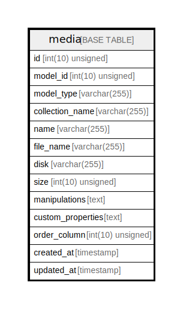

# media

## Description

<details>
<summary><strong>Table Definition</strong></summary>

```sql
CREATE TABLE `media` (
  `id` int(10) unsigned NOT NULL AUTO_INCREMENT,
  `model_id` int(10) unsigned NOT NULL,
  `model_type` varchar(255) COLLATE utf8mb4_unicode_ci NOT NULL,
  `collection_name` varchar(255) COLLATE utf8mb4_unicode_ci NOT NULL,
  `name` varchar(255) COLLATE utf8mb4_unicode_ci NOT NULL,
  `file_name` varchar(255) COLLATE utf8mb4_unicode_ci NOT NULL,
  `disk` varchar(255) COLLATE utf8mb4_unicode_ci NOT NULL,
  `size` int(10) unsigned NOT NULL,
  `manipulations` text COLLATE utf8mb4_unicode_ci NOT NULL,
  `custom_properties` text COLLATE utf8mb4_unicode_ci NOT NULL,
  `order_column` int(10) unsigned DEFAULT NULL,
  `created_at` timestamp NULL DEFAULT NULL,
  `updated_at` timestamp NULL DEFAULT NULL,
  PRIMARY KEY (`id`),
  KEY `media_model_id_model_type_index` (`model_id`,`model_type`)
) ENGINE=InnoDB DEFAULT CHARSET=utf8mb4 COLLATE=utf8mb4_unicode_ci
```

</details>

## Columns

| Name | Type | Default | Nullable | Extra Definition | Children | Parents | Comment |
| ---- | ---- | ------- | -------- | --------------- | -------- | ------- | ------- |
| id | int(10) unsigned |  | false | auto_increment |  |  |  |
| model_id | int(10) unsigned |  | false |  |  |  |  |
| model_type | varchar(255) |  | false |  |  |  |  |
| collection_name | varchar(255) |  | false |  |  |  |  |
| name | varchar(255) |  | false |  |  |  |  |
| file_name | varchar(255) |  | false |  |  |  |  |
| disk | varchar(255) |  | false |  |  |  |  |
| size | int(10) unsigned |  | false |  |  |  |  |
| manipulations | text |  | false |  |  |  |  |
| custom_properties | text |  | false |  |  |  |  |
| order_column | int(10) unsigned |  | true |  |  |  |  |
| created_at | timestamp |  | true |  |  |  |  |
| updated_at | timestamp |  | true |  |  |  |  |

## Constraints

| Name | Type | Definition |
| ---- | ---- | ---------- |
| PRIMARY | PRIMARY KEY | PRIMARY KEY (id) |

## Indexes

| Name | Definition |
| ---- | ---------- |
| media_model_id_model_type_index | KEY media_model_id_model_type_index (model_id, model_type) USING BTREE |
| PRIMARY | PRIMARY KEY (id) USING BTREE |

## Relations



---

> Generated by [tbls](https://github.com/k1LoW/tbls)
