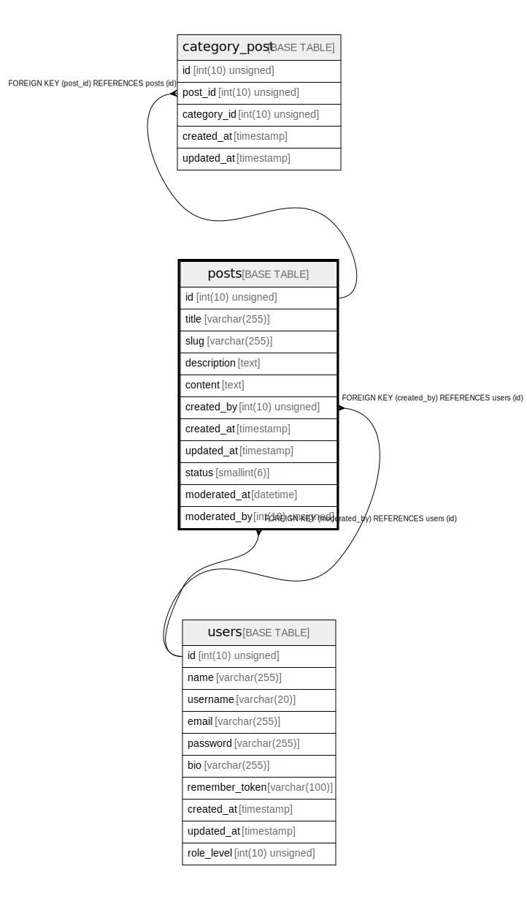

# posts

## Description

<details>
<summary><strong>Table Definition</strong></summary>

```sql
CREATE TABLE `posts` (
  `id` int(10) unsigned NOT NULL AUTO_INCREMENT,
  `title` varchar(255) COLLATE utf8mb4_unicode_ci NOT NULL,
  `slug` varchar(255) COLLATE utf8mb4_unicode_ci NOT NULL,
  `description` text COLLATE utf8mb4_unicode_ci NOT NULL,
  `content` text COLLATE utf8mb4_unicode_ci NOT NULL,
  `created_by` int(10) unsigned NOT NULL,
  `created_at` timestamp NULL DEFAULT NULL,
  `updated_at` timestamp NULL DEFAULT NULL,
  `status` smallint(6) NOT NULL DEFAULT '3',
  `moderated_at` datetime DEFAULT NULL,
  `moderated_by` int(10) unsigned DEFAULT NULL,
  PRIMARY KEY (`id`),
  UNIQUE KEY `posts_slug_unique` (`slug`),
  KEY `posts_created_by_foreign` (`created_by`),
  KEY `posts_moderated_by_foreign` (`moderated_by`),
  CONSTRAINT `posts_created_by_foreign` FOREIGN KEY (`created_by`) REFERENCES `users` (`id`),
  CONSTRAINT `posts_moderated_by_foreign` FOREIGN KEY (`moderated_by`) REFERENCES `users` (`id`)
) ENGINE=InnoDB DEFAULT CHARSET=utf8mb4 COLLATE=utf8mb4_unicode_ci
```

</details>

## Columns

| Name | Type | Default | Nullable | Extra Definition | Children | Parents | Comment |
| ---- | ---- | ------- | -------- | --------------- | -------- | ------- | ------- |
| id | int(10) unsigned |  | false | auto_increment | [category_post](category_post.md) |  |  |
| title | varchar(255) |  | false |  |  |  |  |
| slug | varchar(255) |  | false |  |  |  |  |
| description | text |  | false |  |  |  |  |
| content | text |  | false |  |  |  |  |
| created_by | int(10) unsigned |  | false |  |  | [users](users.md) |  |
| created_at | timestamp |  | true |  |  |  |  |
| updated_at | timestamp |  | true |  |  |  |  |
| status | smallint(6) | 3 | false |  |  |  |  |
| moderated_at | datetime |  | true |  |  |  |  |
| moderated_by | int(10) unsigned |  | true |  |  | [users](users.md) |  |

## Constraints

| Name | Type | Definition |
| ---- | ---- | ---------- |
| posts_created_by_foreign | FOREIGN KEY | FOREIGN KEY (created_by) REFERENCES users (id) |
| posts_moderated_by_foreign | FOREIGN KEY | FOREIGN KEY (moderated_by) REFERENCES users (id) |
| posts_slug_unique | UNIQUE | UNIQUE KEY posts_slug_unique (slug) |
| PRIMARY | PRIMARY KEY | PRIMARY KEY (id) |

## Indexes

| Name | Definition |
| ---- | ---------- |
| posts_created_by_foreign | KEY posts_created_by_foreign (created_by) USING BTREE |
| posts_moderated_by_foreign | KEY posts_moderated_by_foreign (moderated_by) USING BTREE |
| PRIMARY | PRIMARY KEY (id) USING BTREE |
| posts_slug_unique | UNIQUE KEY posts_slug_unique (slug) USING BTREE |

## Relations



---

> Generated by [tbls](https://github.com/k1LoW/tbls)
