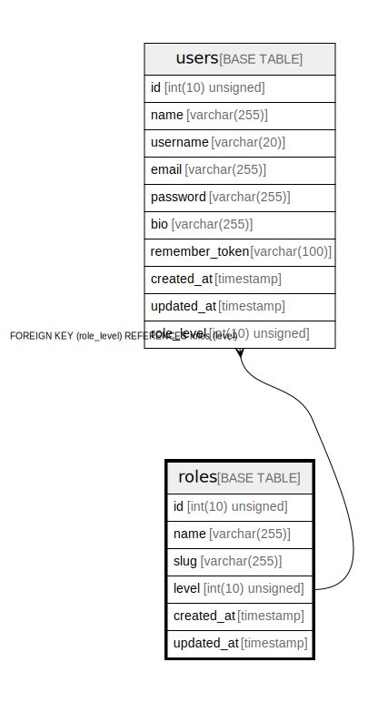

# roles

## Description

<details>
<summary><strong>Table Definition</strong></summary>

```sql
CREATE TABLE `roles` (
  `id` int(10) unsigned NOT NULL AUTO_INCREMENT,
  `name` varchar(255) COLLATE utf8mb4_unicode_ci NOT NULL,
  `slug` varchar(255) COLLATE utf8mb4_unicode_ci NOT NULL,
  `level` int(10) unsigned NOT NULL DEFAULT '1',
  `created_at` timestamp NULL DEFAULT NULL,
  `updated_at` timestamp NULL DEFAULT NULL,
  PRIMARY KEY (`id`),
  UNIQUE KEY `roles_slug_unique` (`slug`),
  KEY `roles_level_index` (`level`)
) ENGINE=InnoDB DEFAULT CHARSET=utf8mb4 COLLATE=utf8mb4_unicode_ci
```

</details>

## Columns

| Name | Type | Default | Nullable | Extra Definition | Children | Parents | Comment |
| ---- | ---- | ------- | -------- | --------------- | -------- | ------- | ------- |
| id | int(10) unsigned |  | false | auto_increment |  |  |  |
| name | varchar(255) |  | false |  |  |  |  |
| slug | varchar(255) |  | false |  |  |  |  |
| level | int(10) unsigned | 1 | false |  | [users](users.md) |  |  |
| created_at | timestamp |  | true |  |  |  |  |
| updated_at | timestamp |  | true |  |  |  |  |

## Constraints

| Name | Type | Definition |
| ---- | ---- | ---------- |
| PRIMARY | PRIMARY KEY | PRIMARY KEY (id) |
| roles_slug_unique | UNIQUE | UNIQUE KEY roles_slug_unique (slug) |

## Indexes

| Name | Definition |
| ---- | ---------- |
| roles_level_index | KEY roles_level_index (level) USING BTREE |
| PRIMARY | PRIMARY KEY (id) USING BTREE |
| roles_slug_unique | UNIQUE KEY roles_slug_unique (slug) USING BTREE |

## Relations



---

> Generated by [tbls](https://github.com/k1LoW/tbls)
