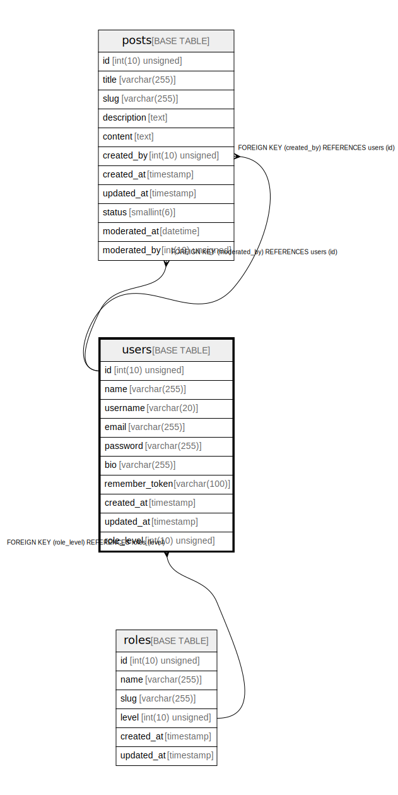

# users

## Description

<details>
<summary><strong>Table Definition</strong></summary>

```sql
CREATE TABLE `users` (
  `id` int(10) unsigned NOT NULL AUTO_INCREMENT,
  `name` varchar(255) COLLATE utf8mb4_unicode_ci NOT NULL,
  `username` varchar(20) COLLATE utf8mb4_unicode_ci NOT NULL,
  `email` varchar(255) COLLATE utf8mb4_unicode_ci NOT NULL,
  `password` varchar(255) COLLATE utf8mb4_unicode_ci NOT NULL,
  `bio` varchar(255) COLLATE utf8mb4_unicode_ci DEFAULT NULL,
  `remember_token` varchar(100) COLLATE utf8mb4_unicode_ci DEFAULT NULL,
  `created_at` timestamp NULL DEFAULT NULL,
  `updated_at` timestamp NULL DEFAULT NULL,
  `role_level` int(10) unsigned NOT NULL DEFAULT '1',
  PRIMARY KEY (`id`),
  UNIQUE KEY `users_username_unique` (`username`),
  UNIQUE KEY `users_email_unique` (`email`),
  KEY `users_role_level_foreign` (`role_level`),
  CONSTRAINT `users_role_level_foreign` FOREIGN KEY (`role_level`) REFERENCES `roles` (`level`)
) ENGINE=InnoDB DEFAULT CHARSET=utf8mb4 COLLATE=utf8mb4_unicode_ci
```

</details>

## Columns

| Name | Type | Default | Nullable | Extra Definition | Children | Parents | Comment |
| ---- | ---- | ------- | -------- | --------------- | -------- | ------- | ------- |
| id | int(10) unsigned |  | false | auto_increment | [posts](posts.md) |  |  |
| name | varchar(255) |  | false |  |  |  |  |
| username | varchar(20) |  | false |  |  |  |  |
| email | varchar(255) |  | false |  |  |  |  |
| password | varchar(255) |  | false |  |  |  |  |
| bio | varchar(255) |  | true |  |  |  |  |
| remember_token | varchar(100) |  | true |  |  |  |  |
| created_at | timestamp |  | true |  |  |  |  |
| updated_at | timestamp |  | true |  |  |  |  |
| role_level | int(10) unsigned | 1 | false |  |  | [roles](roles.md) |  |

## Constraints

| Name | Type | Definition |
| ---- | ---- | ---------- |
| PRIMARY | PRIMARY KEY | PRIMARY KEY (id) |
| users_email_unique | UNIQUE | UNIQUE KEY users_email_unique (email) |
| users_role_level_foreign | FOREIGN KEY | FOREIGN KEY (role_level) REFERENCES roles (level) |
| users_username_unique | UNIQUE | UNIQUE KEY users_username_unique (username) |

## Indexes

| Name | Definition |
| ---- | ---------- |
| users_role_level_foreign | KEY users_role_level_foreign (role_level) USING BTREE |
| PRIMARY | PRIMARY KEY (id) USING BTREE |
| users_email_unique | UNIQUE KEY users_email_unique (email) USING BTREE |
| users_username_unique | UNIQUE KEY users_username_unique (username) USING BTREE |

## Relations



---

> Generated by [tbls](https://github.com/k1LoW/tbls)
