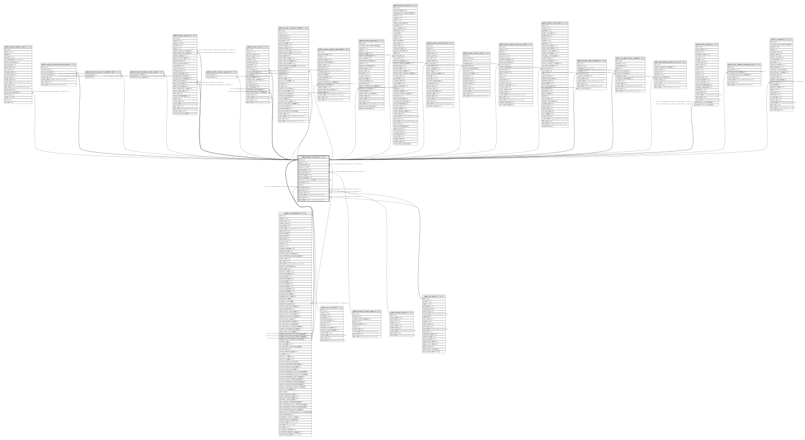

# public.account_account

## Description

Account

## Columns

| Name | Type | Default | Nullable | Children | Parents | Comment |
| ---- | ---- | ------- | -------- | -------- | ------- | ------- |
| id | integer | nextval('account_account_id_seq'::regclass) | false | [public.res_company](public.res_company.md) [public.account_analytic_line](public.account_analytic_line.md) [public.account_fiscal_position_account](public.account_fiscal_position_account.md) [public.account_account_tax_default_rel](public.account_account_tax_default_rel.md) [public.account_account_account_tag](public.account_account_account_tag.md) [public.account_journal](public.account_journal.md) [public.account_account_type_rel](public.account_account_type_rel.md) [public.account_tax](public.account_tax.md) [public.account_reconcile_model](public.account_reconcile_model.md) [public.account_register_payments](public.account_register_payments.md) [public.account_payment](public.account_payment.md) [public.account_invoice](public.account_invoice.md) [public.account_invoice_line](public.account_invoice_line.md) [public.account_invoice_tax](public.account_invoice_tax.md) [public.account_bank_statement_line](public.account_bank_statement_line.md) [public.account_move_line](public.account_move_line.md) [public.account_cash_rounding](public.account_cash_rounding.md) [public.tax_adjustments_wizard](public.tax_adjustments_wizard.md) [public.sale_advance_payment_inv](public.sale_advance_payment_inv.md) [public.stock_location](public.stock_location.md) [public.stock_change_standard_price](public.stock_change_standard_price.md) [public.hr_expense](public.hr_expense.md) |  |  |
| name | varchar |  | false |  |  | Name |
| currency_id | integer |  | true |  | [public.res_currency](public.res_currency.md) | Account Currency |
| code | varchar(64) |  | false |  |  | Code |
| deprecated | boolean |  | true |  |  | Deprecated |
| user_type_id | integer |  | false |  | [public.account_account_type](public.account_account_type.md) | Type |
| internal_type | varchar |  | true |  |  | Internal Type |
| internal_group | varchar |  | true |  |  | Internal Group |
| last_time_entries_checked | timestamp without time zone |  | true |  |  | Latest Invoices & Payments Matching Date |
| reconcile | boolean |  | true |  |  | Allow Reconciliation |
| note | text |  | true |  |  | Internal Notes |
| company_id | integer |  | false |  | [public.res_company](public.res_company.md) | Company |
| group_id | integer |  | true |  | [public.account_group](public.account_group.md) | Group |
| create_uid | integer |  | true |  | [public.res_users](public.res_users.md) | Created by |
| create_date | timestamp without time zone |  | true |  |  | Created on |
| write_uid | integer |  | true |  | [public.res_users](public.res_users.md) | Last Updated by |
| write_date | timestamp without time zone |  | true |  |  | Last Updated on |

## Constraints

| Name | Type | Definition | Comment |
| ---- | ---- | ---------- | ------- |
| account_account_create_uid_fkey | FOREIGN KEY | FOREIGN KEY (create_uid) REFERENCES res_users(id) ON DELETE SET NULL |  |
| account_account_write_uid_fkey | FOREIGN KEY | FOREIGN KEY (write_uid) REFERENCES res_users(id) ON DELETE SET NULL |  |
| account_account_currency_id_fkey | FOREIGN KEY | FOREIGN KEY (currency_id) REFERENCES res_currency(id) ON DELETE SET NULL |  |
| account_account_company_id_fkey | FOREIGN KEY | FOREIGN KEY (company_id) REFERENCES res_company(id) ON DELETE SET NULL |  |
| account_account_user_type_id_fkey | FOREIGN KEY | FOREIGN KEY (user_type_id) REFERENCES account_account_type(id) ON DELETE SET NULL |  |
| account_account_pkey | PRIMARY KEY | PRIMARY KEY (id) |  |
| account_account_code_company_uniq | UNIQUE | UNIQUE (code, company_id) | unique (code,company_id) |
| account_account_group_id_fkey | FOREIGN KEY | FOREIGN KEY (group_id) REFERENCES account_group(id) ON DELETE SET NULL |  |

## Indexes

| Name | Definition |
| ---- | ---------- |
| account_account_pkey | CREATE UNIQUE INDEX account_account_pkey ON public.account_account USING btree (id) |
| account_account_name_index | CREATE INDEX account_account_name_index ON public.account_account USING btree (name) |
| account_account_code_index | CREATE INDEX account_account_code_index ON public.account_account USING btree (code) |
| account_account_deprecated_index | CREATE INDEX account_account_deprecated_index ON public.account_account USING btree (deprecated) |
| account_account_code_company_uniq | CREATE UNIQUE INDEX account_account_code_company_uniq ON public.account_account USING btree (code, company_id) |

## Relations

---

> Generated by [tbls](https://github.com/k1LoW/tbls)
