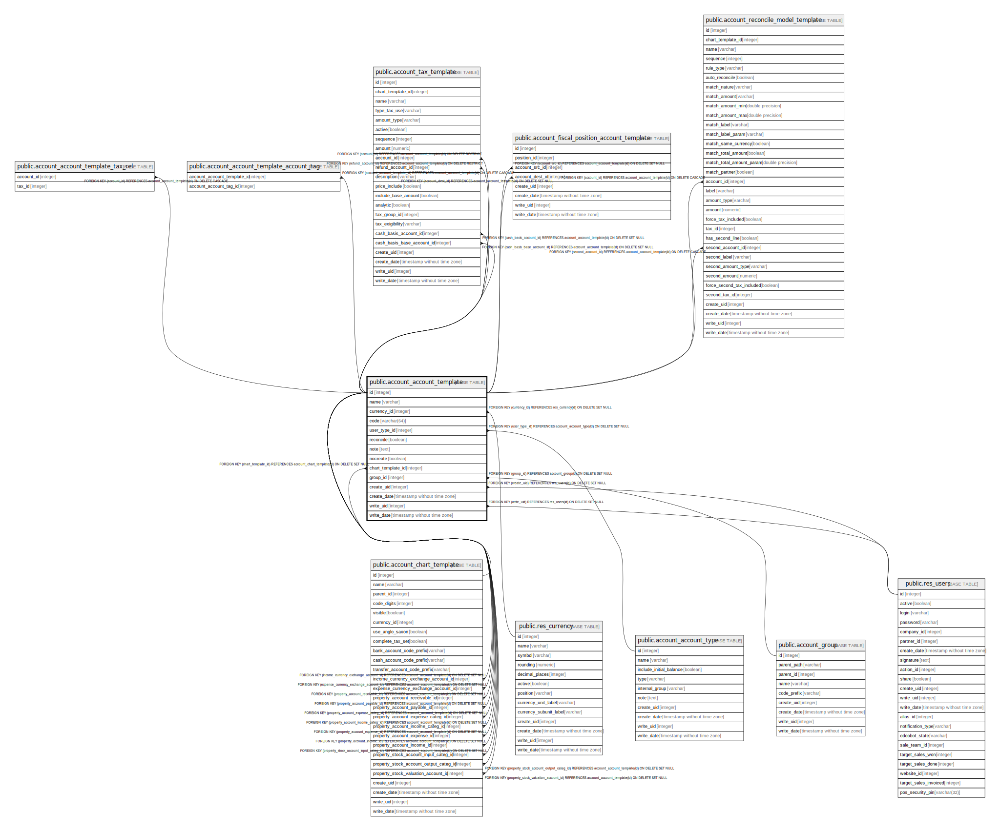

# public.account_account_template

## Description

Templates for Accounts

## Columns

| Name | Type | Default | Nullable | Children | Parents | Comment |
| ---- | ---- | ------- | -------- | -------- | ------- | ------- |
| id | integer | nextval('account_account_template_id_seq'::regclass) | false | [public.account_account_template_tax_rel](public.account_account_template_tax_rel.md) [public.account_account_template_account_tag](public.account_account_template_account_tag.md) [public.account_chart_template](public.account_chart_template.md) [public.account_tax_template](public.account_tax_template.md) [public.account_fiscal_position_account_template](public.account_fiscal_position_account_template.md) [public.account_reconcile_model_template](public.account_reconcile_model_template.md) |  |  |
| name | varchar |  | false |  |  | Name |
| currency_id | integer |  | true |  | [public.res_currency](public.res_currency.md) | Account Currency |
| code | varchar(64) |  | false |  |  | Code |
| user_type_id | integer |  | false |  | [public.account_account_type](public.account_account_type.md) | Type |
| reconcile | boolean |  | true |  |  | Allow Invoices & payments Matching |
| note | text |  | true |  |  | Note |
| nocreate | boolean |  | true |  |  | Optional Create |
| chart_template_id | integer |  | true |  | [public.account_chart_template](public.account_chart_template.md) | Chart Template |
| group_id | integer |  | true |  | [public.account_group](public.account_group.md) | Group |
| create_uid | integer |  | true |  | [public.res_users](public.res_users.md) | Created by |
| create_date | timestamp without time zone |  | true |  |  | Created on |
| write_uid | integer |  | true |  | [public.res_users](public.res_users.md) | Last Updated by |
| write_date | timestamp without time zone |  | true |  |  | Last Updated on |

## Constraints

| Name | Type | Definition |
| ---- | ---- | ---------- |
| account_account_template_create_uid_fkey | FOREIGN KEY | FOREIGN KEY (create_uid) REFERENCES res_users(id) ON DELETE SET NULL |
| account_account_template_write_uid_fkey | FOREIGN KEY | FOREIGN KEY (write_uid) REFERENCES res_users(id) ON DELETE SET NULL |
| account_account_template_currency_id_fkey | FOREIGN KEY | FOREIGN KEY (currency_id) REFERENCES res_currency(id) ON DELETE SET NULL |
| account_account_template_user_type_id_fkey | FOREIGN KEY | FOREIGN KEY (user_type_id) REFERENCES account_account_type(id) ON DELETE SET NULL |
| account_account_template_group_id_fkey | FOREIGN KEY | FOREIGN KEY (group_id) REFERENCES account_group(id) ON DELETE SET NULL |
| account_account_template_pkey | PRIMARY KEY | PRIMARY KEY (id) |
| account_account_template_chart_template_id_fkey | FOREIGN KEY | FOREIGN KEY (chart_template_id) REFERENCES account_chart_template(id) ON DELETE SET NULL |

## Indexes

| Name | Definition |
| ---- | ---------- |
| account_account_template_pkey | CREATE UNIQUE INDEX account_account_template_pkey ON public.account_account_template USING btree (id) |
| account_account_template_name_index | CREATE INDEX account_account_template_name_index ON public.account_account_template USING btree (name) |
| account_account_template_code_index | CREATE INDEX account_account_template_code_index ON public.account_account_template USING btree (code) |

## Relations

---

> Generated by [tbls](https://github.com/k1LoW/tbls)
