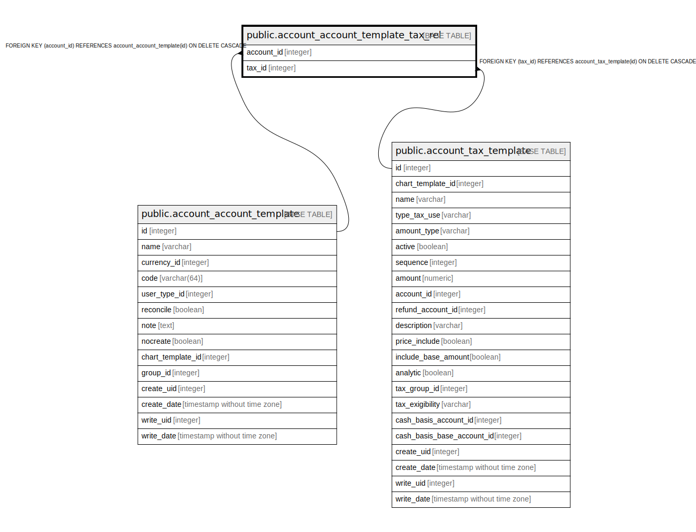

# public.account_account_template_tax_rel

## Description

RELATION BETWEEN account_account_template AND account_tax_template

## Columns

| Name | Type | Default | Nullable | Children | Parents | Comment |
| ---- | ---- | ------- | -------- | -------- | ------- | ------- |
| account_id | integer |  | false |  | [public.account_account_template](public.account_account_template.md) |  |
| tax_id | integer |  | false |  | [public.account_tax_template](public.account_tax_template.md) |  |

## Constraints

| Name | Type | Definition |
| ---- | ---- | ---------- |
| account_account_template_tax_rel_account_id_fkey | FOREIGN KEY | FOREIGN KEY (account_id) REFERENCES account_account_template(id) ON DELETE CASCADE |
| account_account_template_tax_rel_account_id_tax_id_key | UNIQUE | UNIQUE (account_id, tax_id) |
| account_account_template_tax_rel_tax_id_fkey | FOREIGN KEY | FOREIGN KEY (tax_id) REFERENCES account_tax_template(id) ON DELETE CASCADE |

## Indexes

| Name | Definition |
| ---- | ---------- |
| account_account_template_tax_rel_account_id_tax_id_key | CREATE UNIQUE INDEX account_account_template_tax_rel_account_id_tax_id_key ON public.account_account_template_tax_rel USING btree (account_id, tax_id) |
| account_account_template_tax_rel_account_id_idx | CREATE INDEX account_account_template_tax_rel_account_id_idx ON public.account_account_template_tax_rel USING btree (account_id) |
| account_account_template_tax_rel_tax_id_idx | CREATE INDEX account_account_template_tax_rel_tax_id_idx ON public.account_account_template_tax_rel USING btree (tax_id) |

## Relations

---

> Generated by [tbls](https://github.com/k1LoW/tbls)
