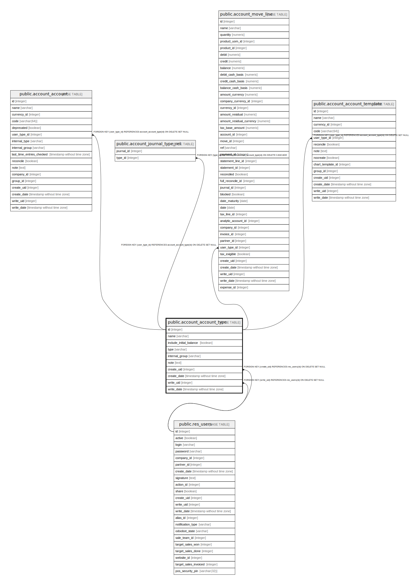

# public.account_account_type

## Description

Account Type

## Columns

| Name | Type | Default | Nullable | Children | Parents | Comment |
| ---- | ---- | ------- | -------- | -------- | ------- | ------- |
| id | integer | nextval('account_account_type_id_seq'::regclass) | false | [public.account_account](public.account_account.md) [public.account_journal_type_rel](public.account_journal_type_rel.md) [public.account_move_line](public.account_move_line.md) [public.account_account_template](public.account_account_template.md) |  |  |
| name | varchar |  | false |  |  | Account Type |
| include_initial_balance | boolean |  | true |  |  | Bring Accounts Balance Forward |
| type | varchar |  | false |  |  | Type |
| internal_group | varchar |  | true |  |  | Internal Group |
| note | text |  | true |  |  | Description |
| create_uid | integer |  | true |  | [public.res_users](public.res_users.md) | Created by |
| create_date | timestamp without time zone |  | true |  |  | Created on |
| write_uid | integer |  | true |  | [public.res_users](public.res_users.md) | Last Updated by |
| write_date | timestamp without time zone |  | true |  |  | Last Updated on |

## Constraints

| Name | Type | Definition |
| ---- | ---- | ---------- |
| account_account_type_create_uid_fkey | FOREIGN KEY | FOREIGN KEY (create_uid) REFERENCES res_users(id) ON DELETE SET NULL |
| account_account_type_write_uid_fkey | FOREIGN KEY | FOREIGN KEY (write_uid) REFERENCES res_users(id) ON DELETE SET NULL |
| account_account_type_pkey | PRIMARY KEY | PRIMARY KEY (id) |

## Indexes

| Name | Definition |
| ---- | ---------- |
| account_account_type_pkey | CREATE UNIQUE INDEX account_account_type_pkey ON public.account_account_type USING btree (id) |

## Relations

---

> Generated by [tbls](https://github.com/k1LoW/tbls)
